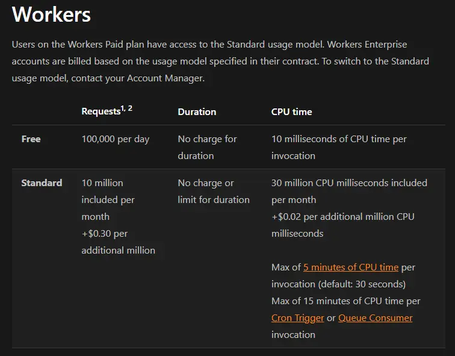
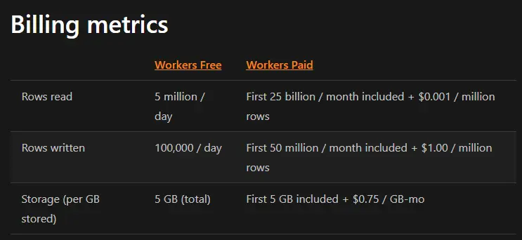
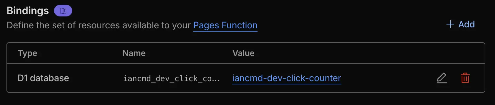

+++
Title = "用 Cloudflare Functions 做免費 Click Counter"
Date = "2025-11-08 15:00:00 +0800 CST"
Description = ""
Tags = ["Serverless"]
menu = "main"
+++


最近要跟學弟們示範如何用 Cloudflare Pages 部屬靜態網站，為了示範這種靜態網站無法處裡動態需求的問題，我就順手在我自己的 Pages（就是這個部落格）裡面寫了一個 Functions。

跟往常一樣，這次的東西我除了 Domain 費用以外不想花任何錢，所有東西都要想辦法塞進能免費給我 Serverless 的服務，所以我這次用了 Pages 的 Functions 功能。它的免費額度跟 Cloudflare Workers 共用，每天有能處理十萬次 Request 的額度。



除此之外我們還需要個可以用來儲存資料的地方，一般直覺會想到用 [KV](https://developers.cloudflare.com/kv/) 做類似 Redis 的 Key-Value Pair 資料庫，但他只有每天一千次的寫入額度，對於每個 Request 都會產生一筆寫入的 Click Counter 來說不太夠。最後我用了 [D1](https://developers.cloudflare.com/d1) SQLite 資料庫，與 Workers 相同每天有十萬次的寫入額度。



## 前置作業

Cloudflare Functions 只要丟到現有的 Pages 的 `functions` 資料夾下就會自動被部署，但是開發上就比較複雜。我平常都是用 [Dev Containers](https://containers.dev/) 直接在 Container 寫文章，但開發 Functions 需要用到的 [Wrangler](https://developers.cloudflare.com/workers/wrangler/) 似乎不太喜歡在 Container 裡面跑，所以我只好拖到外面用 WSL 來跑 Wrangler。

要從 Cloudflare 下載現有的 Pages 的設定檔，可以用以下指令：

```bash
wrangler pages download config iancmd-dev
```

### Cloudflare D1

Cloudflare D1 是 Cloudflare 提供的 Serverless SQLite 資料庫服務，免費方案有十個資料庫、每天讀取五百萬航和十萬次寫入的限制，並且每個資料庫有 10GB 的儲存空間上限，

要建立 D1 資料庫只需要在 Wrangler CLI 執行以下指令：

```bash
wrangler d1 create iancmd-dev-click-counter
```

Cloudflare 就會在離下這個指令的電腦延遲最低的 Region 新增一個 D1 資料庫，並且我們需要把產生的設定手動加到 `wrangler.toml` 裡面。

我用的 Schema 很簡單，只有一個 Table 裡面放頁面與點擊數的 Key-Value Pair：

```sql
CREATE TABLE IF NOT EXISTS click_counts (
  path TEXT PRIMARY KEY,
  count INTEGER NOT NULL DEFAULT 0
);
```

建立資料庫之後，我們要把這份 Schema 在 Local 執行，開發完 Functions 並確認沒問題後再上傳到 Cloudflare 的 D1：

```bash
wrangler d1 execute iancmd-dev-click-counter --local --file=schema.sql
wrangler d1 execute iancmd-dev-click-counter --remote --file=schema.sql
```

最後為了要讓我們的 Functions 可以存取到 D1，我們需要到 Cloudflare Dashboard 在 Pages 裡面新增一個連線到 D1 的 Bindings



### Cloudflare Functions

由於我想要使用 TypeScript 開發，我們需要先產生 Functions 的 TypeScript 定義檔：

```bash
wrangler types functions/worker-configuration.d.ts
```

接下來只要在 `functions` 資料夾底下建立 `tsconfig.json` 檔案，VS Code 就會自動辨識型態和提供型態定義：

```json
{
  "compilerOptions": {
    "types": [
      "worker-configuration.d.ts",
      "node"
    ]
  }
}
```

接下來在想要的路徑建立 TypeScript 檔案，Cloudflare 會自動把檔案編譯成 JavaScript，並且部署到與檔案同名的路徑，例如我的檔案在 `functions/click-counter.ts`並且裡面只有 POST 的 Handler，那麼這個 Function 就會被部署到 Pages 的 `/click-counter`，並且只接受 POST Request。

```typescript
type Row = {
  path: string
  count: number
}

export const onRequestPost: PagesFunction<Env> = async (ctx) => {
  const request: Request = ctx.request

  let path = (await request.text()).trim()
  while (path.length > 2 && path.endsWith('/')) path = path.slice(0, -1)
  if (path === '') path = '/'
  if (!/^[0-9a-zA-Z-_/]{1,100}$/.test(path))
    return new Response('Bad Hacker', { status: 400 })

  const db = ctx.env.iancmd_dev_click_counter

  const stmt = db.prepare(
    'UPDATE click_counts SET count = count + 1 WHERE path = ? RETURNING *'
  )
  let result = await stmt.bind(path).run<Row>()

  if (result.results.length === 0) {
    const insertStmt = db.prepare(
      'INSERT INTO click_counts (path, count) VALUES (?, 1) RETURNING *'
    )
    result = await insertStmt.bind(path).run<Row>()
  }

  return new Response(result.results[0].count.toString())
}
```

這裡可以看到，用了 Cloudflare 提供的客製化 d.ts 之後，我們能非常優雅地取得 Env 裡面的 D1 Bindings。

我們可以用以下指令在開發環境測試 Functions：

```bash
wrangler pages dev ./public
```

這個指令會在電腦上開一個 Pages 的開發伺服器，並且會把 `public/` 資料夾底下的靜態檔案當成 Pages 內容。

最後我們還要修改靜態網站的內容，讓他可以去呼叫我們的 Functions：

```html
<span>
  Views: <span id="click-counter">0</span>
</span>
```

```javascript
;(async () => {
  const clickCounter = document.getElementById('click-counter')
  const request = await fetch('/click-counter', {
    method: 'POST',
    body: window.location.pathname,
  })
  const clickCount = await request.text()
  if (clickCounter != null && request.ok) clickCounter.innerText = clickCount
})()
```

最後把整個 Repo 塞到 GitHub，Cloudflare 就會自動把我們的 Functions 與靜態網站一起部署上去。
