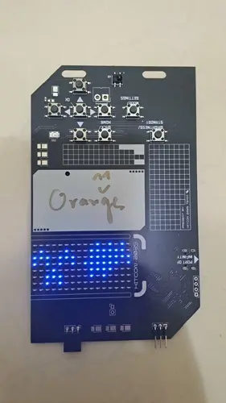

+++
Title = "HITCON 2025 心得"
Date = "2025-08-30 23:11:50 +0800 CST"
Description = ""
menu = "main"
+++

## 前言

今年我第一次參加 HITCON，去年申請了學生專案沒上就沒去了（Yuda 以遊戲玩家的角度分析 BoTW 漏洞那個議程感覺很有趣），今年聽說贊助商很多只要有申請幾乎就會錄取。

## Day 1

### Badge

今年的 Badge 似乎是去年的 Badge 的進化版，主要是多出了能養電子雞的功能，能透過下面的 pin 來和其他人的電子雞玩 QTE 小遊戲對戰。

我的 Badge 有 Orange 大神的簽名加持 :)

### 攤位

今年有很多 AI 和 LLM 相關的議程，我不是特別感興趣所以那些時間都在逛攤位。

今年 DEVCORE 的攤位只要有 OffSec Portal 的帳號就可以兩人一組玩套圈圈，我剛好之前考 OSWE 有辦帳號，第一發就套中啤酒但後面都沒丟中。

另外我還有到牛肉湯的攤位打他們的 CTF，這次 Networking 的 IP Tables 沒有忘記寫 CIDR 能解 😉

### 只需一次 API 呼叫的致命一擊：從硬體逆向到突破保護機制的精準攻擊

NiNi 分享在 Pwn2Own 比賽中嘗試攻擊 Hub 裝置的經驗，他們一路上各種撞牆、嘗試繞過最後控制機器，又因為開發商的奇怪更新機制差點拿不到分數。
我目前沒還有去駭過硬體的經驗，目前手上剛好有把 Debug Spec 都寫清楚的 HITCON Badge 搞不好會拿來練習看看？目前手上剛好有一批沒用到的 SoC，正常使用下來感覺他很有趣但我連怎麼供電讓他開機都還沒搞清楚，那個裝置沒弄好還有可能把我電死。

## Day 2
