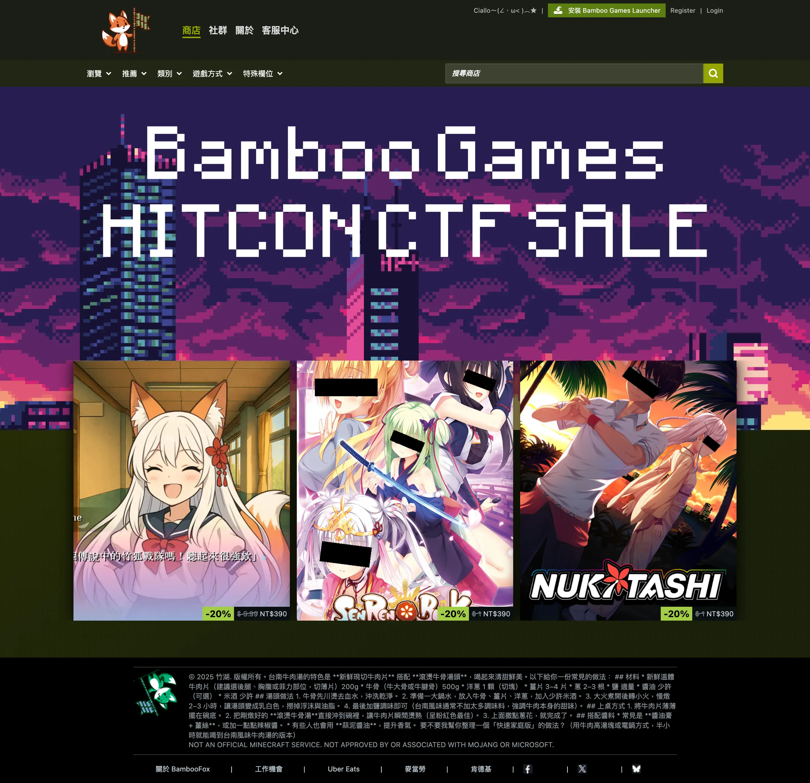
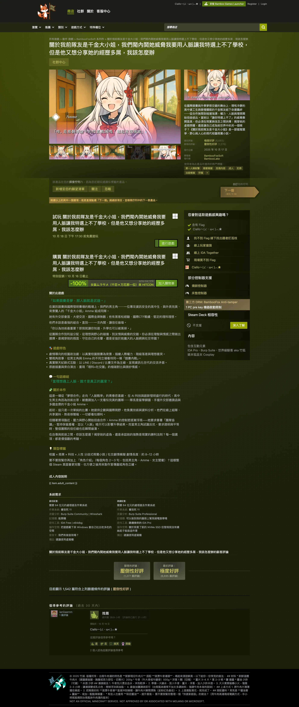
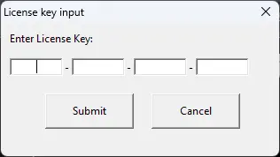
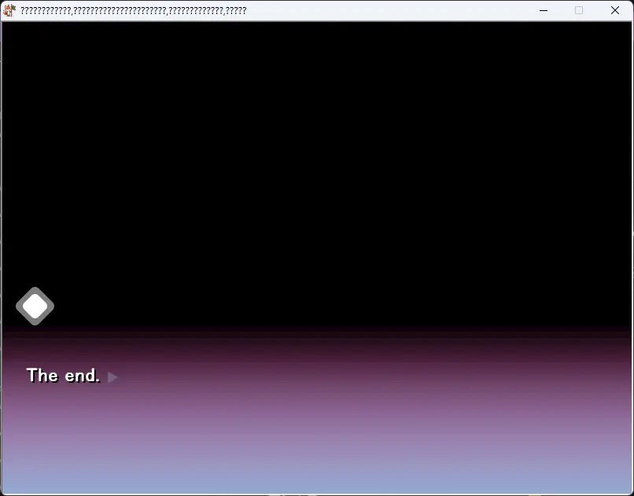
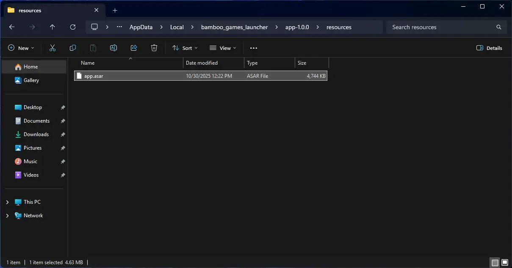
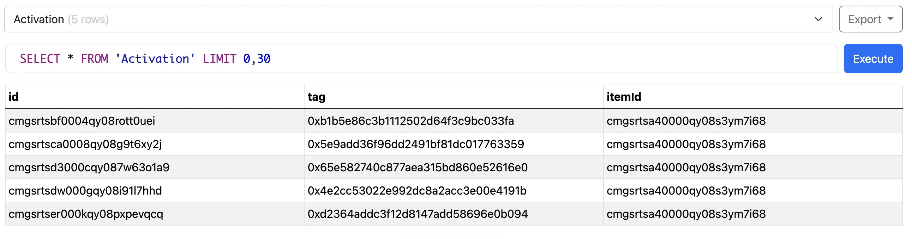

+++
Title = "HITCON Exhibition CTF 2025 Writeup"
Date = "2025-10-31 15:00:00 +0800 CST"
Description = ""
Tags = ["CTF", "Author Writeup"]
Categories = ["CTF"]
menu = "main"
+++

## 前言

今年的 HITCON CTF 沒有分開舉辦預賽決賽，而是邀請 CTF 前四名的台灣隊伍與 ISIP 推薦的兩個隊伍進行交流賽，並且以 Belluminar（由參賽者互相出題、解題、講解與互評）搭配 eSport（LiveCTF）的賽制進行比賽。

今年我作為竹狐的成員之一參賽，並且我們在這場比賽中拿下了第一名。

我參與了我們隊伍中難度較低的題目，「關於我前隊友是千金大小姐，我們鬧內鬨她威脅我要用人脈讓我特選上不了學校，但是他又想分享她的經歷多屌，我該怎麼辦」的題目設計，其分類為 web, misc, reverse, galgame，如果想要看到整個比賽的心得可以看看我們隊長 Ching367436 寫的文章（施工中，晚點放連結）。

## 參與本題目設計的隊友們

- [Ching367436](https://blog.ching367436.me/)：遊戲製作人、Infra
- 燒餅不加蛋：男主角
- [Dr. dog](https://asia-hokak.github.io/)：DRM 設計
- [毛哥EM](https://elvismao.com/)：遊戲平台前端
- [whiteskull](https://github.com/whiteskull20)：遊戲開發
- [Flydragon](https://flydragonw.github.io/)：遊戲開發支援
- [yofat](https://yofat.github.io/)：立繪詠唱
- [堇姬Naup](https://naup.mygo.tw/)：竹狐娘本娘兼水銀燈老婆
- 我：遊戲平台和他的 Electron Launcher

## 探索

打開題目後會進入一個~~抄~~很像 Steam 的遊戲平台



點擊與題目同名的遊戲後會進入商店介面



- 這個平台是個沒有用到 JavaScript 的 SPA，所有的互動都是透過 HTMX 讓後端回傳 HTML 來更新前端
- 有瀏覽遊戲、註冊、登入和留言的 Endpoint，但輸入過濾得很乾淨
- 右上角有個按鈕可以下載 Bamboo Games Launcher，下載後會得到一個 exe 檔，那個是 Electron 的安裝擋，不需要去逆向他
- 有很多按鈕按下去會 [Ciallo～(∠・ω< )⌒★](javascript:(new%20Audio('ciallo.adts')).play())，~~我們聽到會很興奮~~

把 Electron 的安裝檔打開後會看到桌面上多了一個叫做 Bamboo Games Launcher 的程式捷徑，並且 Electron 會自動啟動，打開後會看到跟剛剛網頁一樣的遊戲平台介面但少了下載 Launcher 的按鈕，~~就像是現在大多數的網站一樣~~。經過探索會發現用 Launcher 時遊戲商店頁面的試玩按鈕的文字會不太一樣，點下去他下載遊戲，等遊戲下載完後再點一下就能打開遊戲。



啟動遊戲後會看到一個輸入 License Key 的畫面，但我們現在手上沒有 License Key，點擊取消還是可以進入遊戲的主選單。



經過探索遊戲之後，我們會發現不輸入 License Key 的遊戲只會是試玩版，輸入正確的 License Key 才能玩到完整版遊戲並拿到 Flag。

我們的題目分成許多部分，以下將講解我負責的 web 的解題過程。

## 取得原始碼

Electron 預設會將自己安裝到 `C:\Users\username\AppData\Local\bamboo_games_launcher` 底下，並且只要用 `@electron/asar`（Electron 中用來打包檔案，類似 tarball 的格式）解開 `app-1.0.0/resources/app.asar` 就能取得 Electron App 的原始碼。



（但經過我的測試，其實連裝 `asar` 解包都不需要，只要在 VS Code 中隨便開一個資料夾把 asar 檔案拖進去 VS Code 就會把 asar 檔案當作資料夾幫你解開，畢竟 VS Code 自己也是 Electron 寫的）

我們可以看到他解出來了四個連混淆都沒有的 JavaScript 檔案，但其中只有 `src` 底下的兩個 JavaScript 是我寫的。打開 `src/index.js`（簡單來講是 Electron App 的主程式）會看到一段非常有趣的程式碼：

```javascript
// Hardcode value to prevent XSS to RCE.
const gameId = 'bamboo-gal'
const executable = `./${gameId}/game.exe`
const baseUrl = 'https://xn--kpr97vl4kg3x.xn--e5x.tw:9114/'

ipcMain.handle('install-game', async () => {
  const gz = Buffer.from(
    await (
      await fetch(`${baseUrl}static/..%2Fgames/${gameId}.asar.gz`, {})
    ).arrayBuffer()
  )
});
```

我們可以看到，這個 Launcher 下載遊戲的方法是對後端伺服器做 LFI！

整理一下後可以看到他會去下載 `https://蒸氣平台.狐.tw:9114/static/..%2Fgames/bamboo-gal.asar.gz` 這個檔案，我們可以猜測後端伺服器的檔案結構大致如下：

```text
- static
  - style.css
  - ciallo.aac
  - static files...
- games
  - bamboo-gal.asar.gz
- package.json?
- Dockerfile?
```

經過測試，我們可以成功下載到 `Dockerfile`，從裡面可以看到這個專案的確有 `package.json`，但是有某些原因下載該檔案會回傳 404，並且嘗試去讀專案資料夾外的檔案（如 `/proc/self/environ`）也會 404。

仔細看下載 `Dockerfile` 的 `Content-Type` 是 `application/x-binary` 而非標準的 `application/octet-stream`，我們猜測後端有某種機制決定某個檔案是否能被下載，並且 `Dockerfile` 可能被當作 ELF 檔案而被允許下載，那這樣是不是所有沒有副檔名的檔案都能被下載？

那這樣一個系統上還會有甚麼檔案躺在專案資料夾內而沒有副檔名？

`.git`！`.git` 只要專案沒有出現 [Packfiles](https://git-scm.com/book/en/v2/Git-Internals-Packfiles) 的話每一個做 .git leak 需要的檔案都非常完美的沒有副檔名，並且打開 `Dockerfile` 也可以看到我很明顯在 `prod` 上故意設定了一個空的 git repository 並把所有檔案都 commit 進去。簡單測試後，我們可以成功下載到 `.git/HEAD`。

接著我們需要找能幫我們下載整個 `.git` 的工具，經過測試只有 [arthaud/git-dumper](https://github.com/arthaud/git-dumper) 能成功下載，其他工具可能是因為路徑中有 `../` 而無法正常運作。

```sh
pip install git-dumper
git-dumper https://xn--kpr97vl4kg3x.xn--e5x.tw:9114/static/..%2F/.git/ website/
ls website
Dockerfile   README.md   bin   bun.lock   compose.yaml   eslint.config.mjs   package.json   prisma   readkey.c   src   static  template   tsconfig.json   歐內該
```

## 分析網站

下載完網站原始碼我們能發現這個專案用了 [Bun](https://bun.sh/) JavaScript Runtime、[Hono](https://hono.dev/) Web Framework 和 [Prisma](https://www.prisma.io/docs/getting-started/quickstart-sqlite) ORM。

剛剛我們用來取得原始碼的 LFI 在 `src/index.ts`：

```typescript
app.get('/static/*', async (c) => {
  const filePath = decodeURIComponent('/app' + new URL(c.req.raw.url).pathname)
  const allowedExtensions = {
    '.html': 'text/html;',
    '.svg': 'image/svg+xml',
    '.ico': 'image/x-icon',
    '.png': 'image/png',
    '.webp': 'image/webp',
    '.webm': 'video/webm',
    '.css': 'text/css',
    '.aac': 'audio/aac',
    '.adts': 'audio/aac',
    '.gz': 'application/gzip',
    '.xp3': 'application/krkr-resource-file',
    '.exe': 'application/vnd.microsoft.portable-executable',
    '.dll': 'application/i-do-not-know-what-to-put-here-fuck-microsoft',
    '': 'application/x-binary',
  }
  const parsedPath = path.parse(path.normalize(filePath))

  if (!parsedPath.dir.startsWith('/app')) return c.text('Not Found', 404)
  if (allowedExtensions.hasOwnProperty(parsedPath.ext) === false) {
    return c.text('Not Found', 404)
  }
  const file = Bun.file(filePath)
  if (!(await file.exists())) return c.text('Not Found', 404)

  c.header(
    'Content-Type',
    // @ts-ignore: No index signature with a parameter of type 'string' was found
    `${allowedExtensions[parsedPath.ext]}; charset=utf-8`
  )

  return c.body(await file.arrayBuffer())
})
```

可以看到這個 Static File Handler 會將進來的 Request URL 過一次 URI Decode，只要是路徑在 `/app` 下或是附檔名在白名單就會直接放行，只要想辦法讓 Hono 用到這個 Handler 就能達成 LFI。我原本想要就直接這樣讓大家通靈，但要猜到這邊有 LFI 有點難度才生出了前面的整個 Electron Launcher。

接下來我們要想辦法把資料庫的內容也 Dump 下來，打開 `prisma/schema.prisma` 可以看到：

```prisma
datasource db {
  provider = "sqlite"
  url      = "file:./db"
}
```

去 LFI `static/..%2F/prisma/db` 就能把 SQLite 資料庫下載下來，接著把整個資料庫丟到 [SQLite Viewer](https://inloop.github.io/sqlite-viewer/) 就能看到下一步需要的東西：



分析完遊戲中的 `plugin/clientDLL.dll`（我相信各位逆向狂魔已經在打到這步前就逆到他了，我看到現場一堆人在逆我的 Electron 安裝檔、Electron 本身跟 krkr 本體）後，我們可以發現 DRM 會像這台伺服器的 `/api/verify` 發送 POST Request 來驗證 License Key 與 HWID，如果驗證成功就會拿收到的 Body 去解密正式版遊戲檔案，我們從 `src/api.ts` 開始追這個 Endpoint 如何運作：

```typescript
.post('/verify', async (c) => {
  const { license, computerInfo, itemId } = await c.req.parseBody()
  if (license == null || computerInfo == null)
    return c.render('back-to-home', { message: 'Bad Hacker' }, 400)
  if (typeof license != 'string' || typeof computerInfo != 'string')
    return c.render('back-to-home', { message: 'Bad Hacker' }, 400)
  if (itemId != null && typeof itemId != 'string')
    return c.render('back-to-home', { message: 'Bad Hacker' }, 400)

  if (!(await verifyActivation(license, computerInfo, itemId)))
    return c.text('Verification failed', 400)

  return c.text(await readkey())
})
```

首先他會驗證所有輸入的參數有沒有混入奇怪的東西，接著呼叫 `src/crypto.ts` 的 `verifyActivation()` 來驗證 License Key 與 HWID：

```typescript
import { PrismaClient } from '@prisma/client'
import { randomBytes } from 'node:crypto'

const prisma = new PrismaClient()

function bytesToBigInt(bytes: Uint8Array): bigint {
  let hex = ''
  bytes.forEach((byte) => {
    hex += byte.toString(16).padStart(2, '0')
  })
  return BigInt('0x' + hex)
}

function bigIntToBytes(bn: bigint, size: number): Uint8Array {
  let hex = bn.toString(16)
  if (hex.length % 2) {
    hex = '0' + hex
  }
  const len = hex.length / 2
  const u8 = new Uint8Array(len)
  let i = 0
  let j = 0
  while (i < len) {
    u8[i] = parseInt(hex.slice(j, j + 2), 16)
    i += 1
    j += 2
  }
  if (u8.length < size) {
    const padded = new Uint8Array(size)
    padded.set(u8, size - u8.length)
    return padded
  }
  return u8
}

function H(s: bigint): bigint {
  const m = bigIntToBytes(s, 128)
  const hasher = new Bun.CryptoHasher('md5')
  hasher.update(m)
  return BigInt('0x' + hasher.digest('hex'))
}

function generateActivation(r: bigint, s: bigint): bigint {
  let acc = BigInt('0')
  const p = (BigInt('1') << BigInt(128)) - BigInt(159)
  for (let i = 0; i < 6; i++) {
    acc += s
    acc = (r * acc) % p
    s = H(s)
  }
  acc += s
  return acc % p
}

function calculateActivationTag(
  license: string,
  computerInfo: string
): string | false {
  let r: bigint
  try {
    r = BigInt(`0x${license}`)
  } catch (e) {
    return false
  }
  if (r.toString(16).length != 32) return false

  const hasher = new Bun.CryptoHasher('md5')
  hasher.update(computerInfo)
  const s = bytesToBigInt(hasher.digest() as Uint8Array)

  return `0x${generateActivation(r, s).toString(16)}`
}

export async function generateLicense(itemId: string, license?: string) {
  if (license == null) license = randomBytes(16).toString('hex')
  while (BigInt(`0x${license}`).toString(16).length != 32) {
    license = randomBytes(16).toString('hex')
  }

  return (
    await prisma.license.create({
      data: { itemId, content: license },
    })
  ).content
}

export async function activateLicense(
  license: string,
  computerInfo: string,
  itemId: string | undefined
): Promise<boolean> {
  if (itemId == null) itemId = (await prisma.item.findFirst())?.id
  if (itemId == null) return false
  if (!(await prisma.license.findUnique({ where: { content: license } })))
    return false
  const tag = calculateActivationTag(license, computerInfo)
  if (!tag) return false
  const result = await prisma.$transaction(async (tx) => {
    try {
      const exitingLicense = await tx.license.update({
        where: { content: license },
        data: { usedCount: { increment: 1 } },
      })
      if (exitingLicense.usedCount >= exitingLicense.totalUses) {
        await tx.license.delete({ where: { id: exitingLicense.id } })
      }
      return await tx.activation.create({ data: { tag, itemId } })
    } catch (e) {
      return false
    }
  })
  if (!result) return false
  return true
}

export async function verifyActivation(
  license: string,
  computerInfo: string,
  itemId: string | undefined
): Promise<boolean> {
  if (itemId == null) itemId = (await prisma.item.findFirst())?.id
  const tag = calculateActivationTag(license, computerInfo)
  if (!tag) return false

  const activation = await prisma.activation.findFirst({
    where: { tag, itemId },
  })

  console.log(
    `verifyActivation: license=${license} computerInfo=${computerInfo} tag=${tag} activation=${
      activation == null ? 'false' : 'true'
    }`
  )

  if (!activation) return activateLicense(license, computerInfo, itemId)
  return true
}
```

從我們剛剛拿到的 Database Dump 可以看到系統上沒有任何尚未啟用的 License Key，並且我們沒有其他手段能去產生新的 License Key，所以只能用密碼學的方式想辦法繞過檢查，讓我們目前的 HWID 能與偽造的 License Key 算出來有相同的 `activationTag`。這部分的密碼學函數是隊友 Dr. dog 設計的，~~我其實看不懂怎麼算只是把它從 Python 翻譯成了 TypeScript~~。

最後最下面的 `readkey()` 會去執行一個簡單的 suid helper，為了避免 LFI 會不小心洩漏 key 所以我們把 server 打成 nobody 用它來讀解密 Key，~~幾本上是直接複製貼上 HITCON CTF 的 readflag.c 只是他讀的東西不是 Flag~~。

接下來要解密遊戲檔案有幾個做法，像是直接對伺服器丟 Request 拿到 Key 再研究解密演算法，或是想辦法在 DLL 送出 Request 前就把 License 跟 HWID 改成能正確通過驗證的值。

但實際上我在把題目組裝在一起時忘記把解密 Key 也拿出來放到 Volume，導致上述的密碼學其實都可以被跳過，直接拿 Dockerfile 裡面的值來解密檔案就行，~~不過還好現場沒人發現，大家都在埋頭 Reverse 奇怪的東西~~。
