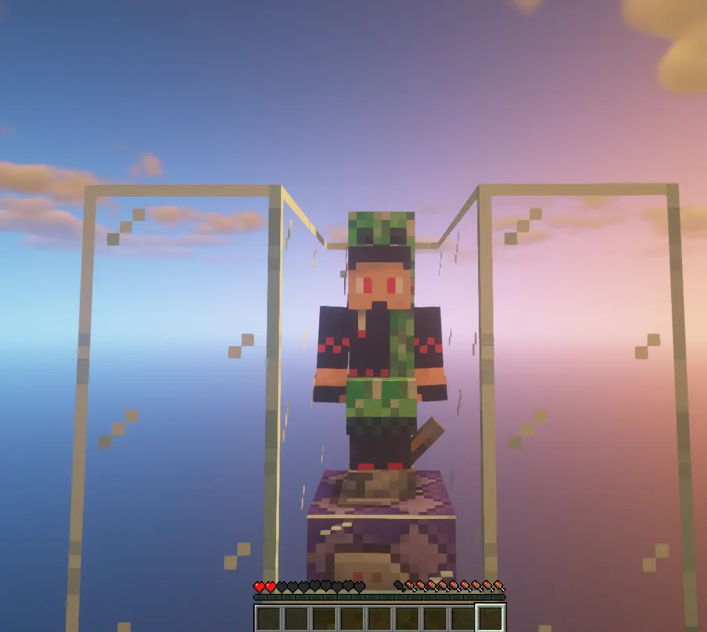

{
  "Title": "Minecraft 如何以指令關閉玩家生物推擠",
  "Description": "關於 Minecraft 如何只使用指令關閉玩家生物推擠，",
  "date": "2023-08-12  00:00:00.000000000 +0800 CST",
  "Tags": [
    "Minecraft"
  ],
  "categories": [
    "Minecraft"
  ],
  "menu": "main",
  "alias": [
    "/2021/07/no-collision-with-commands.html"
  ]
}


100 隻被我關掉 AI 與碰撞的 Creeper

1. 創造一個隊伍，這裡我把隊伍命名為 noCollision，這個隊伍會包含所有不會被推擠的東西（包含玩家與生物）。\
    `/team add noCollision`，`noCollision` 可以換成想要的隊伍名稱，指令後面可以用雙引號接上顯示名稱。
2. `/team modify noCollision collisionRule <選項>`，這邊的選項必須是下列四種的其中一種：
    * `always` 預設值，不會有改變
    * `never` 不會**被**任何東西推擠
    * `pushOtherTeams` 不會**被**這個隊伍以外的東西推擠
    * `pushOwnTeam` 只會**被**這個隊伍的東西推擠
3. 將所有要套用上一步設定的實體加入隊伍。由於無法讓生物生成或玩家加入時直接加入隊伍，所以需要用個永遠執行的指令方塊。指令方塊位置要保持被載入。  
    `/give @p minecraft:command\_block`\
    使用指令方塊需要切換到創造模式：\
    `/gamemode creative`\
    將指令方塊設定為重複 `Repeat`、無條件 `Unconditional`、永遠啟動`Always Active`，並選擇指令版本輸入指令方塊：
    * 只有玩家加入隊伍  
        `/execute as @a\[team=!noCollision\] run team join noCollision @s`
    * 將所有東西加入隊伍（這會導致怪物不會攻擊）  
        `/execute as @e\[team=!noCollision\] run team join noCollision @s`
    * 將例外以外的生物加入隊伍，紅色那段可以自行擴充  
        `/execute as @a\[team=!noCollision\] run execute as @s\[type=!minecraft:(例外生物的 ID)\] run team join noCollision @s`
4. 最後關掉指令方塊輸出就完成了。`/gamerule commandBlockOutput false`

附註：`config/paper-global.yml`

```yml
collisions:
  enable-player-collisions: true # 是否開啟玩家間碰撞
  send-full-pos-for-hard-colliding-entities: true # 是否傳送完整位置給客戶端，這會使用更多頻寬但碰撞會更精準
```
