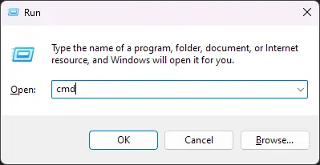

{
  "title": "Minecraft Java 伺服器架設從零到有",
  "description": "關於 Minecraft: Java Edition 的各種伺服器介紹與教學。",
  "tags": [
    "Minecraft"
  ],
  "categories": [
    "Minecraft"
  ],
  "date": "2023-08-11",
  "menu": "main",
  "aliases": [
    "/2019/05/minecraftjavaserver.html"
  ]
}

<!-- markdownlint-disable MD024 -->

本文章將會有 [Minecraft: Java edition](https://www.minecraft.net/zh-hant/store/minecraft-java-bedrock-edition-pc) 的各種伺服器簡介與教學，並且只會提到 Java edition，也就是只能在電腦（包含 Windows、Linux 跟 macOS）玩的版本。
**文章很長！請善用 Ctrl+F**  

## 介紹

Minecraft 是一個可玩性無限的遊戲。獨樂樂不如眾樂樂，為了讓玩家們可以一起玩遊戲、一起創造屬於大家的世界，Mojang 從非常早期的 Classic 版本就為遊戲加入了多人連線功能，現在伺服器不斷被改良，從原本小型生存伺服器遍地開花，隨著時代的發展，慢慢演變出能跨伺服器連線的大型小遊戲伺服器。

* Vanilla —— 官方發布的原版伺服器。
* CraftBukkit —— 修改 Vanilla 讓 Bukkit 插件得以運作並最佳化。
* Spigot —— 修改 CraftBukkit 並做了更多最佳化。
* Paper —— 修改 Spigot 並做了更多最佳化。

以上三者都是可使用 Bukkit API，一般稱為插件伺服器，通常為 CraftBukkit 寫的插件 Spigot 跟 Paper 能執行，Spigot 的插件 Paper 能執行。

* Forge —— 允許安裝 Forge 模組。
* NeoForge —— Forge 管理團隊不爽 Forge 原開發者嘴太臭，Fork 出來的版本，與 Forge 能共存。
* Fabric —— 允許安裝 Fabric 模組。

後三者通常需要伺服器與客戶端安裝相同的模組才可順利連線遊玩，Forge 與 Fabric 使用不同的 modloader，無法共存。

## 下載

### JRE 下載

自架伺服器需要自行安裝 Java 執行環境（Java Runtime Environment），不像官方啟動器會自帶。64 位元電腦選擇 x64 版本，否則伺服器無法被分配到大於 4 GB 的記憶體。  

* 1.16.5 以下版本：[Java 8](https://adoptium.net/temurin/releases/?version=8)
* 1.17 到 1.17.1：[Java 16](https://adoptium.net/temurin/releases/?version=16)
* 1.18 以上：[Java 17](https://adoptium.net/temurin/releases/?version=17)

### 伺服器檔案下載

* [Vanilla （官方）](https://www.minecraft.net/zh-hant/download/server)
* [CraftBukkit](https://getbukkit.org/download/craftbukkit)
* [Spigot](https://getbukkit.org/download/spigot)
* [Paper](https://papermc.io/downloads)
* [Forge](https://files.minecraftforge.net/net/minecraftforge/forge/)
* [NeoForge](https://neoforged.net/)
* [Fabric](https://fabricmc.net/use/server/)

下載 Jar 檔案後請創建新的資料夾並放入，伺服器在首次執行時會自動建立其所需檔案。從 Forge 取得安裝檔並啟動後，選擇 Install server 並指定伺服器將被裝到的目錄，點擊 OK 會自動下載所需檔案到指定目錄。


## 安裝

下載完後，要先執行一次讓它建立與下載需要的檔案，點兩下打開或是輸入以下指令：  

```bash
java -jar 伺服器檔案名.jar nogui
```

執行後打開 eula.txt 會看到：

```properties
#By changing the setting below to TRUE you are indicating your agreement to our EULA (https://account.mojang.com/documents/minecraft_eula).
eula=false
```

閱讀 [Minecraft 的 EULA](https://www.minecraft.net/en-us/eula) 後並修改檔案，將上方的檔案內容改為 `eula=true` 伺服器才會啟動。

### 編寫啟動腳本

由於伺服器啟動時通常需要額外的參數，為了快速啟動並固定內容，建議編寫啟動腳本。若伺服器下載後已自帶啟動腳本，可跳過此步驟或閱讀啟動腳本客製化。詳細的 JVM 參數可參考 [Configuring the Default JVM and Java Arguments](https://docs.oracle.com/cd/E22289_01/html/821-1274/configuring-the-default-jvm-and-java-arguments.html)。

#### Windows

在伺服器 `.jar` 檔案同一個資料夾處建立一個名為 `run.bat` 的檔案，並輸入以下內容：

```bat
java -Xmx4G -Xms4G -jar 伺服器檔案名.jar nogui
```

這樣對 `run.bat` 點兩下即可快速啟動。其中 `-Xmx4G -Xms4G` 是指定伺服器最大記憶體為 4GB，可依實際需求調整。`nogui` 是指定伺服器不要開啟圖形介面，以節省資源。

#### Linux/macOS

在伺服器 `.jar` 檔案同一個資料夾處建立一個名為 `run.sh` 的檔案，並輸入以下內容：

```bash
#!/bin/bash
java -Xmx4G -Xms4G -jar 伺服器檔案名.jar nogui
```

然後執行 `chmod +x run.sh` 讓使用者有執行權限，往後執行 `./run.sh` 即可以啟動伺服器。Linux 環境下若不指定 `nogui`，伺服器可能會因找不到圖形介面相關的套件而無法啟動。

另外，Linux 環境下也可以使用 [`screen`](https://linux.die.net/man/1/screen) 讓伺服器在背景執行，例如：

```bash
screen -S -m minecraft java -Xmx4G -Xms4G -jar 伺服器檔案名.jar nogui
```

伺服器啟動時就會在背景執行，若要操控伺服器控制台可使用 `screen -r` 來連線到伺服器，Ctrl + A，Ctrl + D 再次放到背景執行。搭配 [crontab](https://linux.vbird.org/linux_basic/centos7/0430cron.php) 可以讓伺服器在重新開機後自動執行。

## 設定

### 所有伺服器

同意 Eula 並重新執行伺服器會自動產生所需的檔案。

* world/：伺服器預設的的地圖資料夾，非 Vanilla 可能會有更多資料夾。  
* banned-players.json banned-ips.json：紀錄被封鎖的玩家或 IP，無法登入伺服器。  
* whitelist.json：白名單，伺服器開啟白名單時只有清單上的玩家才可登入。  
* ops.json：管理員（OP）名單。  
* server-icon.png：伺服器的標誌，可以放 64x64 的圖，會顯示在選伺服器頁面的左邊。  
* logs/：存放伺服器的記錄檔的資料夾。  
* usercache.json：伺服器上玩家資料暫存檔案，不需理會。  
* eula.txt：伺服器是否同意 EULA。  
* server.properties：伺服器設定預設值和說明（會被遊戲內設定覆蓋）：  

#### server.properties

```properties
# 伺服器在多人連線選單中顯示的字樣
motd=A Minecraft Server
# 伺服器 IP，正常狀況下不用理會
server-ip= 
# 伺服器 Port，每個 Port 只能存在一個服務，若非使用預設的 25565，則需要在連線時加上「:數值」
server-port=25565 
# 玩家數量上限
max-players=20 
# 重生點保護（2x+1）格，管理員無視，0 關閉
spawn-protection=16 
# 遊戲難度（peaceful/easy/normal/hard）
difficulty=easy 

# 預設遊戲模式（survival/creative/adventure/spectator）
gamemode=survival 
# 登入時是否強制切換為以上 gamemode
force-gamemode=false 
# 白名單是否開啟
white-list=false 
# 啟動白名單時是否踢出不在白名單上的玩家
enforce-whitelist=false 

# 是否廣播控制台指令的結果給管理員
broadcast-console-to-ops=true 
# 玩家掛機多少分鐘會踢出
player-idle-timeout=0 
# 是否在多人遊戲選擇畫面中顯示伺服器上線
enable-status=true 
# 是否隱藏線上的玩家
hide-online-players=false 
# 預設的管理員權限（1 到 4），決定可以用的指令強度，請參閱 Minecraft Wiki
op-permission-level=4 
# 是否與 Mojang 連線檢查玩家遊戲帳號，關閉後就算是正版玩家也不會有外觀
online-mode=true 

# 預設是否開啟同隊（/party，無隊伍視同相同隊伍）玩家傷害
pvp=true 
# 是否啟用指令方塊，玩地圖要開
enable-command-block=false 
# function pack 能用的指令等級
function-permission-level=2 
# 使否允許飛行（可能造成玩家意外被踢）
allow-flight=false 
# 伺服器是否啟用極限模式，死後成為旁觀不能復活（管理員指令可復活）
hardcore=false 

# 世界檔案的所在資料夾名稱
level-name=world 
# 地圖型態（minecraft:normal/flat/large_biomes/amplified/single_biome_surface）
level-type=minecraft:normal 
# 設定地圖生成條件（超平坦世界中的方案集）
generator-settings={} 
# 生成世界時使用的種子碼
level-seed= 

# 是否生成動物
spawn-animals=true 
# 是否生成村民
spawn-npcs=true 
# 是否生成怪物
spawn-monsters=true 
# 是否啟用地獄
allow-nether=true 
# 世界的 XY 軸各往正負延伸多少格
max-world-size=29999984 
# 預設視野距離
view-distance=10 
# 預設伺服器處理生物範圍
simulation-distance=10 
# 是否生成結構
generate-structures=true 

# 是否強制使用材質包
require-resource-pack=false 
# 材質包的 uri
resource-pack= 
# 強制使用材質包時的提示
resource-pack-prompt=
# 材質包的 sha1 雜湊，確保玩家使用的是正確的材質包
resource-pack-sha1= 

# 是否啟用 GameSpy4 協議
enable-query=false 
# GameSpy4 的 port
query.port=25565 

# 是否啟用 RCON（讓伺服器管理員不須登入即可使用指令的協定）
enable-rcon=false 
# RCON 控制的port
rcon.port=25575 
# RCON 用的密碼
rcon.password= 
# 是否把 RCON 的結果廣播給管理員
broadcast-rcon-to-ops=true 

# 如果伺服器處理一個 tick 太久即判斷崩潰，單位毫秒，-1 停用
max-tick-time=60000 
# 檢查玩家與 Mojang 和伺服器連線的 ISP 是否一致
prevent-proxy-connections=false 
# 超過多少位元組的封包會被壓縮（-1 關閉，0 壓縮所有），建議 > 64，< 1500 
network-compression-threshold=256 
# 伺服器是否傳送除錯資訊給 Mojang
snooper-enabled=true 
# 是否啟用給 Linux 系統的網路最佳化
use-native-transport=true 
# 是否啟用 JMX
enable-jmx-monitoring=false 
```

### Forge/NeoForged 伺服器

* mods/：放伺服器欲載入的的 mods  
* run.bat：Windows 的伺服器啟動腳本，點兩下即可啟動伺服器  
* run.sh：Linux/macOS 的伺服器啟動腳本
* user\_jvm\_args.txt：設定 JVM 參數  
* config/：模組設定檔案資料夾  
* defaultconfigs/：創建新世界時會被複製到 world/serverconfig/，模組包作者用  

### 插件伺服器

* plugins/：伺服器使用的插件、設定檔（通常插件會自行建立相同名稱的資料夾存放設定檔）
* plugins/PluginMetrics/：用來在[bStats](https://bstats.org/)統計伺服器上的插件使用情況等等數據
* [help.yml](https://bukkit.fandom.com/wiki/Help.yml)：/help 指令的自訂內容  
* [bukkit.yml](https://bukkit.fandom.com/wiki/Bukkit.yml)：CraftBukkit 的設定檔
* [spigot.yml](https://www.spigotmc.org/wiki/spigot-configuration/)：Spigot 的設定檔
* [config/paper-global.yml](https://paper.readthedocs.io/en/latest/server/configuration.html)：Paper 的設定檔

#### bukkit.yml

```yml
settings: # 一般設定
  allow-end: true
    # 是否啟用終界
  warn-on-overload: true
    # 是否在伺服器 tick 處理過久警告超載
  permissions-file: permissions.yml
    # 權限設定檔案（通常會直接由權限插件處理）
  update-folder: update
    # 這個名子的資料夾中的插件伺服器重開時會自動更新
  use-exact-login-location: false
    # 是否在玩家登入時使用他們的正確位置（而非安全位置）
  world-container: worlds
    # 世界資料夾的位置
  plugin-profiling: false
    # 是否啟用 /timing 指令，方便找出插件的效能問題
  connection-throttle: 0
    # 連線的冷卻時間，單位毫秒
  query-plugins: true
    # 是否回傳查詢插件的結果
  deprecated-verbose: default
    # 是否在插件呼叫了已棄用的程式時發出警告
  shutdown-message: Server closed
    # 伺服器關閉時時玩家試圖連線的錯誤訊息
  minimum-api: none
    # 是否阻止插件的不支援 API 被載入
  use-map-color-cache: true
spawn-limits: # 每個世界能生怪的上線值
chunk-gc: # 幾個 tick 要清理一次不須使用但沒有成功從記憶體清除的 Chunk
  period-in-ticks: 600
ticks-per: # 每多少 tick 觸發一次以下事件
auto-updater:
  enabled: true # 自動更新相關
```

[commands.yml](https://bukkit.fandom.com/wiki/Commands.yml)：設定指令的縮寫，範例：

```yml
command-block-overrides:
  - "give" 
  # 代表讓 Minecraft 接管指令方塊的 /give 指令，不使用 Bukkit 的最佳化版本 
aliases:
  lobby:
  - rg teleport -w lobby lobby
  # 範例：當玩家使用了 /lobby，伺服器視為玩家執行了 /rg teleport -w lobby lobby
  # 同時 /lobby 指令可以被設定特殊權限，例如不能使用 /rg teleport 的一般玩家也能使用 /lobby
```

#### spigot.yml

```yml
# 由於 Spigot 的設定檔案太多，這裡只列出一些常用的
config-version: 12
settings:
  log-named-deaths: true # 是否記錄被命名的實體死亡
  log-villager-deaths: true # 是否記錄村民死亡
  debug: false
  save-user-cache-on-stop-only: false # 是否只在伺服器關閉時才儲存玩家快取
  bungeecord: false
  sample-count: 12 # 顯示在玩家清單上的玩家數量
  timeout-time: 60 # 伺服器無回應崩潰時間，單位為秒
  restart-on-crash: true # 伺服器崩潰時是否自動重啟
  restart-script: ./run.sh # 重啟（/restart）時執行的腳本檔案名稱
messages: # 訊息設定
advancements: # 進度設定
commands:
  log: true
  tab-complete: 0 # 自動輸入要在輸入多少個字元後才會顯示
  spam-exclusions: # 不會被視為濫發的指令
  - /skill
  replace-commands: # 使用原版的指令
world-settings:
  default:
    hopper-can-load-chunks: false # 漏斗是否能載入區塊
    below-zero-generation-in-existing-chunks: true # 1.18 升級時是否生成負 Y 座標的方塊
    hunger: # 飽食度調整
    max-tick-time:
      tile: 50
      entity: 50
    growth: # 作物生長速度調整
    entity-activation-range: #生物應該在多遠的距離被啟動
    ticks-per:
      hopper-transfer: 8
      hopper-check: 1
```

#### config/paper-global.yml

```yml
_version: 28
block-updates: # 方塊更新相關
chunk-loading: # 區塊載入相關
collisions: # 碰撞相關
commands: # 指令自動輸入相關
console: # 控制台相關
item-validation: # 避免物品資料量過大 Chunk ban
messages: # 訊息
misc:
  chat-threads: # 聊天室執行緒數量
    chat-executor-core-size: -1
    chat-executor-max-size: -1
  fix-entity-position-desync: true # 修正實體位置與客戶端不同步
  lag-compensate-block-breaking: true # 修正方塊破壞的延遲
  load-permissions-yml-before-plugins: true
  max-joins-per-tick: 3 # 每個 tick 最多能有幾個玩家登入
packet-limiter: # 封包限制
player-auto-save: # 玩家資料自動儲存
proxies:
  bungee-cord:
    online-mode: true
  proxy-protocol: false
  velocity:
    enabled: false
    online-mode: false
    secret: ''
spam-limiter: # 濫發封包限制
timings: # /timings 指令相關
watchdog: # 伺服器監控相關
  early-warning-delay: 10000
  early-warning-every: 5000
```

## 連線

每台伺服器與客戶端之間的連線狀況都不同，這邊只列出一些常見情況。\
若伺服器與客戶端在同一台電腦上，使用 `localhost` 或是 `127.0.0.1` 即可連線。

### 尋找我的 IP

#### Windows

1. 開啟命令提示字元：按下 `Win + R`，輸入 `cmd`，按下 `Enter`。

2. 在黑底白字的視窗內輸入 `ipconfig`，按下 `Enter`。
3. 找到你的網路介面卡，通常是 `以太網路卡` 或是 `無線區域網路卡`。
4. 找到 `IPv4 位址`，通常是 `192.168.X.X` 或是 `10.X.X.X`，且第三個點後通常不是 `1` 且第一個數字不是 `255`。

#### Linux

```bash
ip addr
或是
ifconfig
```

如果你的伺服器與客戶端使用同一個網路，直接輸入得到的 IP 即可連線。

### Port Forwarding

如果你的伺服器與客戶端不在同一個網路，並且網際網路服務供應商有提供 IP，你可以進行 [Port Forwarding](https://zh.wikipedia.org/zh-tw/%E7%AB%AF%E5%8F%A3%E8%BD%AC%E5%8F%91)。詳情請參考 IP 分享器的使用手冊。\
測試是否成功：[CanYouSeeMe](https://canyouseeme.org/)（選擇 `Port 25565`）（有時也會遇到前面沒有裝置擋著，可以先用工具試試看再設定）。

### VPN

如果上述方法都無法使用，你可以使用 [VPN 服務](https://zh.wikipedia.org/wiki/%E8%99%9B%E6%93%AC%E7%A7%81%E4%BA%BA%E7%B6%B2%E8%B7%AF)，例如 [ZeroTier](https://www.zerotier.com/) 或是 [Hamachi](https://www.vpn.net/)。這裡只需要用到 VPN 建立虛擬網路的功能，不需要用於連上網際網路。

## 管理

這邊只列出一些常用或是在單人下沒有的指令，更多指令請參考 [Minecraft Wiki](https://minecraft.fandom.com/zh/wiki/%E6%8C%87%E4%BB%A4?variant=zh-tw)。

```mcfunction
op <玩家> # 給予玩家 OP 權限
deop <玩家> # 移除玩家的 OP 權限

ban <玩家> [原因] # 封鎖玩家
ban-ip <IP> [原因] # 封鎖 IP

pardon <玩家> # 解除玩家封鎖
pardon-ip <IP> # 解除 IP 封鎖

whitelist add <玩家> # 將玩家加入白名單
whitelist remove <玩家> # 將玩家移出白名單
whitelist reload # 重新載入白名單
whitelist list # 列出白名單
whitelist on # 開啟白名單
whitelist off # 關閉白名單

kick <玩家> [原因] # 踢出玩家

reload # 重新載入伺服器，建議條件允許還是 /stop 再啟動比較好

stop # 關閉伺服器

forge tps # 顯示 Forge 伺服器 TPS（每秒鐘處理的遊戲刻數，20 刻為 1 秒）
tps # 顯示伺服器 TPS，除了原版都會有這個或類似的指令，正常順暢的伺服器 TPS 應該要保持在 20
```

## 常見問題

注：`---- Minecraft Crash Report ----` 下一行的註解是彩蛋。\
請求協助時請[附上 Crash Report](https://pastebin.com/)，並且不要用手機拍螢幕。

* `Connection refused: no further information`：遊戲看到目標位置有裝置，但是看不到伺服器
* `Connection timed out: no further information`：目標位置沒有回應或是沒有裝置
* `Internal Exception: java.net.SocketException`：可能是伺服器無法發送或處理封包，通常是負載過高或崩潰
* `無效的 session`：[購買正版](https://www.minecraft.net/zh-hant/store/minecraft-java-bedrock-edition-pc)或是重開遊戲
